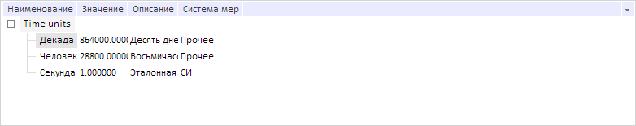

# DictionaryTree.loadNodes

DictionaryTree.loadNodes
-

# DictionaryTree.loadNodes

## Синтаксис

loadNodes(keys: Array, withSelect: Boolean, focusLast: Boolean);

## Параметры

keys. Массив ключей элементов, до которых нужно загрузить дерево;

withSelect. Признак выделения элементов после загрузки. Если параметр имеет значение true, то элементы будут выделены после загрузки, иначе - нет;

focusLast. Признак установки фокуса на последний элемент в массиве ключей. Если параметр имеет значение true, то фокус будет установлен, иначе - не будет.

## Описание

Метод loadNodes загружает справочник до элементов с указанными ключами.

## Пример

Для выполнения примера предполагается наличие на странице компонента [DictionaryBox](../../../Components/Rds/DictionaryBox/DictionaryBox.htm) с наименованием «dictionaryBox» (см. «[Пример создания компонента DictionaryBox](../../../Components/Rds/DictionaryBox/DictionaryBox_Example.htm)» ). Получим дерево элементов справочника, перезагрузим данные до вершины с указанным индексом, после чего выделим её:

// Получим область данных справочника
var area = dictionaryBox.getDataArea();
// Получим дерево элементов справочника
var tree = area.getActiveDictTree();
// Загрузим данные до указанной вершины и выделим её
tree.loadNodes([tree._Source.getChildEls()[0].getKey()], true, true);

В результате данные были перезагружены и элемент был выделен:

См. также:

[DictionaryTree](DictionaryTree.htm)

		Справочная
		 система на версию 10.9
		 от 18/08/2025,
		 © ООО «ФОРСАЙТ»,
