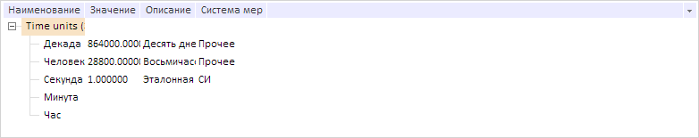
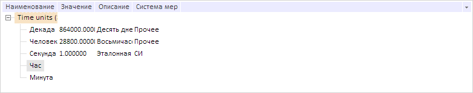
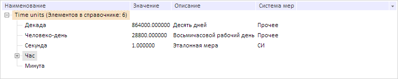
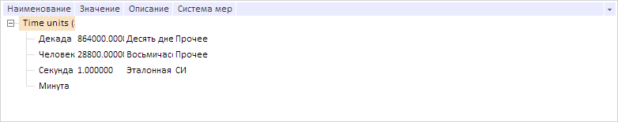

# DictionaryTree.moveItem

DictionaryTree.moveItem
-

# DictionaryTree.moveItem

## Синтаксис

moveItem(key: Number, targetKey: Number, relation:
 [PP.Mb.TreeRelation](dhtmlMetabase.chm::/Enums/TreeRelation.htm));

## Параметры

key. Ключ перемещаемого элемента.
 Если параметр не указан, то метод перемещает все выделенные элементы;

targetKey. Ключ элемента, относительно которого происходит перемещение;

relation. Соотношение элементов.

## Описание

Метод moveItem перемещает элемент
 в указанную позицию относительно другого элемента.

## Пример

Для выполнения примера предполагается наличие на странице компонента
 [DictionaryBox](../../../Components/Rds/DictionaryBox/DictionaryBox.htm)
 с наименованием «dictionaryBox» (см. «[Пример
 создания компонента DictionaryBox](../../../Components/Rds/DictionaryBox/DictionaryBox_Example.htm)» ). Добавим в дерево вручную 2 элемента
 с наименованиями «Минута» и «Час»:

Получим массив дочерних элементов корневого узла дерева. Поместим элемент
 с индексом 4 перед элементом с индексом 3:

// Получим область данных справочника
var area = dictionaryBox.getDataArea();
// Получим дерево элементов справочника
var tree = area.getActiveDictTree();
// Получим массив дочерних элементов корневого узла дерева
var items = tree._Source.getChildEls();
// Поместим элемент с индексом 4 перед элементов с индексом 3
tree.moveItem(items[4].getKey(), items[3].getKey(), PP.Mb.TreeRelation.PrevSibling);
В результате элемент был перемещен:

Скопируем в буфер обмена элемент с индексом 4 и вставим его на позицию
 элемента с индексом 3 как его дочерний элемент:

// Скопируем в буфер обмена элемент с индексом 4
tree.pushToClipboard(PP.Rds.Ui.TreeOperations.CopyElements, [items[4].getKey()]);
// Вставим в элемент с указанным ключом значение из буфера обмена
tree.pasteClipboard(items[3].getKey());
В результате элемент с индексом 4 был скопирован в указанную позицию:

Удалим элемент с индексом 3

tree.removeItem([items[3].getKey()], false);
В результате был удален элемент с индексом 3:

См. также:

[DictionaryTree](DictionaryTree.htm)

		Справочная
		 система на версию 10.9
		 от 18/08/2025,
		 © ООО «ФОРСАЙТ»,
