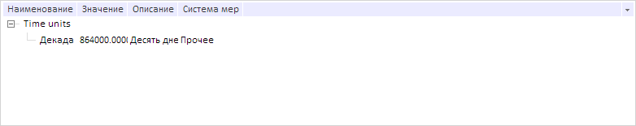

# DictionaryTree.setFilter

DictionaryTree.setFilter
-

# DictionaryTree.setFilter

## Синтаксис

setFilter(textFilter: Object);

## Параметры

textFilter. JSON-объект на стройками фильтра.

## Описание

Метод setFilter устанавливает фильтр, на основе которого осуществляется поиск элементов в дереве.

## Пример

Для выполнения примера предполагается наличие на странице компонента [DictionaryBox](../../../Components/Rds/DictionaryBox/DictionaryBox.htm) с наименованием «dictionaryBox» (см. «[Пример создания компонента DictionaryBox](../../../Components/Rds/DictionaryBox/DictionaryBox_Example.htm)» ). Получим дерево элементов справочника, обработаем событие [NodesFiltered](DictionaryTree.NodesFiltered.htm). Определим и установим фильтр:

// Получим область данных справочника
var area = dictionaryBox.getDataArea();
// Получим дерево элементов справочника
var tree = area.getActiveDictTree();
// Обработаем событие NodesFiltered
tree.NodesFiltered.add(function (sender, eventArgs) {
    console.log("Инициировано событие NodesFiltered");
});
// Определим фильтр
var filter = {
    caseSensitive: false,
    text: "Декада"
};
// Установим фильтр
tree.setFilter(filter);

В результате был установлен фильтр поиска данных:

Также в консоли браузера было выведено сообщение о вызове обработанного события:

Инициировано событие NodesFiltered

См. также:

[DictionaryTree](DictionaryTree.htm)

		Справочная
		 система на версию 10.9
		 от 18/08/2025,
		 © ООО «ФОРСАЙТ»,
