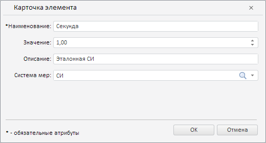

# Конструктор ElementCard

Конструктор ElementCard
-

# Конструктор ElementCard

## Синтаксис

PP.Rds.Ui.ElementCard(settings: Object);

## Параметры

settings. JSON-объект со значениями
 свойств класса.

## Описание

Конструктор ElementCard создает
 экземпляр класса [ElementCard](ElementCard.htm).

## Пример

Для выполнения примера предполагается наличие на странице компонента
 [DictionaryBox](../../../Components/Rds/DictionaryBox/DictionaryBox.htm)
 с наименованием «dictionaryBox» (см. «[Пример
 создания компонента DictionaryBox](../../../Components/Rds/DictionaryBox/DictionaryBox_Example.htm)»). Получим дерево элементов справочника
 и массив дочерних элементов корневого узла дерева. Создадим карточку редактирования
 элемента дерева и отобразим её, выведем признак корректности введенных
 значений:

// Получим область данных справочника
var area = dictionaryBox.getDataArea();
// Получим дерево элементов справочника
var tree = area.getActiveDictTree();
// Получим массив дочерних элементов корневого узла дерева
var items = tree.getSource().getChildEls();
// Определим карточку редактирования элемента
var elCard = new PP.Rds.Ui.ElementCard({
    Source: tree.getSource(), // Источник данных
    Mode: PP.Rds.ElementOperation.Update, // Тип операции
    Locale: tree._ElementsLocale, // Код локали
    UpdElKey: items[2].getKey(), // Ключ редактируемого элемента
});
// Отобразим карточку редактирования элемента
elCard.showDialog();
// Выведем признак корректности введенных значений
console.log("Признак корректности введенных значений: " + elCard.checkValues());
В результате была отображена карточка редактирования элемента с указанным
 ключом:

Также в консоли браузера было выведено сообщение о корректности введенных
 значений:

Признак корректности введенных значений: true

См. также:

[ElementCard](ElementCard.htm)

		Справочная
		 система на версию 10.9
		 от 18/08/2025,
		 © ООО «ФОРСАЙТ»,
