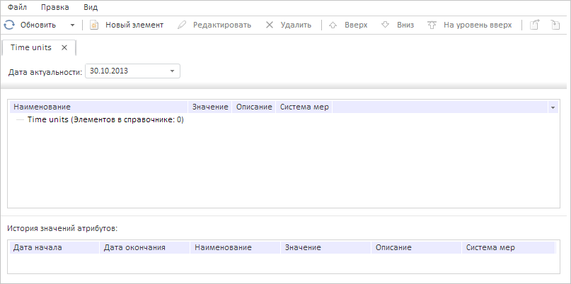

# RdsService.cleanUp

RdsService.cleanUp
-

# RdsService.cleanUp

## Синтаксис

cleanUp(dict: [PP.Rds.Dictionary](../Dictionary/Dictionary.htm), conditions: Object, callback: function|PP.Delegate);

## Параметры

dict. Справочник НСИ;

conditions. Условия очистки элементов справочника. Параметр представляет собой JSON-объект, который может содержать поле closeDate - дата актуальности элемента;

callback. Возвратная функция.

## Описание

Метод cleanUp выполняет очистку справочника.

## Пример

Для выполнения примера необходимо наличие на странице компонента [DictionaryBox](../../../Components/Rds/DictionaryBox/DictionaryBox.htm) с наименованием «dictionaryBox» (см. «[Пример создания компонента DictionaryBox](../../../Components/Rds/DictionaryBox/DictionaryBox_Example.htm)» ). Очистим все элементы справочника с датой актуальности «2013-10-30» и обработаем событие [RdsCleaned](RdsService.RdsCleaned.htm):

var source = dictionaryBox.getSource()[0];
// Получим сервис для работы со справочником
var service = source.getPPService();
// Обработаем событие RdsCleaned
service.RdsCleaned.add(function (sender, args) {
    console.log("Справочник «%s» был очищен", args.Dictionary.getName());
});
// Очистим только элементы справочника с датой актуальности 30.10.2013
var conditions = {
    conds: {
        Item: []
    }
};
conditions.closeDate = "2013-10-30";
// Выполним очистку справочника по заданному условию
service.cleanUp(source, conditions, function () {
    // Обновим дерево элементов справочника
    dictionaryBox.getDataArea().getActiveDictTree().refreshAll(true);
});

В результате выполнения примера были очищены все элементы справочника с датой актуальности «2013-10-30».

После срабатывания обработчика события [RdsCleaned](RdsService.RdsCleaned.htm) в консоли браузера было выведено уведомление об очистке справочника:

Справочник «Time units» был очищен

См. также:

[RdsService](RdsService.htm)

		Справочная
		 система на версию 10.9
		 от 18/08/2025,
		 © ООО «ФОРСАЙТ»,
