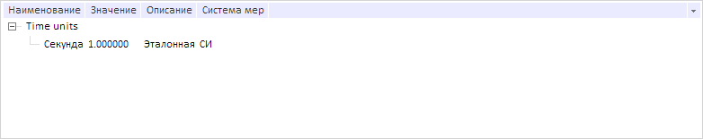

# RdsService.getFilterElements

RdsService.getFilterElements
-

# RdsService.getFilterElements

## Синтаксис

getFilterElements(dict: [PP.Rds.Dictionary](../Dictionary/Dictionary.htm), filter: Object, callback: function|PP.Delegate);

## Параметры

dict. Справочник НСИ;

filter. Объект с настройками фильтра;

callback. Возвратная функция.

## Описание

Метод getFilterElements применяет для элементов справочника НСИ указанный фильтр.

## Пример

Для выполнения примера необходимо наличие на странице компонента [DictionaryBox](../../../Components/Rds/DictionaryBox/DictionaryBox.htm) с наименованием «dictionaryBox» (см. «[Пример создания компонента DictionaryBox](../../../Components/Rds/DictionaryBox/DictionaryBox_Example.htm)» ). Отфильтруем элементы справочника по строке «Секунда» и обработаем событие [ChildLoaded](RdsService.ChildLoaded.htm):

// Получим справочник НСИ
var source = dictionaryBox.getSource()[0];
// Получим сервис для работы со справочником
var service = source.getPPService();
// Обработаем событие ChildLoaded
service.ChildLoaded.add(function (sender, args) {
    if (args.IsFilter) {
        console.log("Применён фильтр");
    };
});
// Возвратаная функция для метода onChildLoaded
function onChildLoaded(sender, args) {
    var tree = dictionaryBox.getDataArea().getActiveDictTree();
    // Получим настройки
    var filter = args.Args.Filter ? args.Args.Filter : null;
    tree._Filter = filter;
    // Установим дочерние элементы
    tree.setChildNodes(args.Args.ParentKey);
    // Получим отфильтрованные элементы
    var els = source.getFilterChildEls("");
    var filteredEls = [];
    for (var i = 0; i < els.length; i++) {
        filteredEls.push(els[i].getName());
    };
    console.log("Наименования отфильтрованных элементов: %s", filteredEls.toString());
};
// Зададим настройки фильтра
var filter = {
    levels: -1,
    text: {
        text: "Секунда",
    }
};
// Применим фильтр
service.getFilterElements(source, filter, PP.Delegate(onChildLoaded, this, {
    ParentKey: "",
    Filter: filter // Настройки фильтра
}));

В результате выполнения примера элементы справочника НСИ были отфильтрованы по строке «Секунда»:

После срабатывания обработчика события [ChildLoaded](RdsService.ChildLoaded.htm) и после выполнения возвратной функции в консоли браузера были выведены следующие уведомления:

Применён фильтр

Наименования отфильтрованных элементов: Секунда

См. также:

[RdsService](RdsService.htm)

		Справочная
		 система на версию 10.9
		 от 18/08/2025,
		 © ООО «ФОРСАЙТ»,
