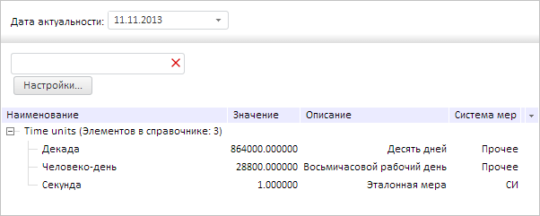

# Пример совместного создания компонентов DictionaryTree, ParamsBox и FindBox

Пример совместного создания компонентов DictionaryTree, ParamsBox и FindBox
-

# Пример совместного создания компонентов DictionaryTree, ParamsBox и FindBox

Для выполнения примера необходимо создать html-страницу и выполнить следующие действия:

1. Добавить ссылки на css-файлы PP.css и PP.Rds.css.

Также нужно добавить ссылки на следующие js-файлы: PP.js, PP.Metabase.js, PP.Rds.js, resources.ru.js.

2. Далее в теге <head> необходимо добавить сценарий, который создаёт дерево элементов справочника НСИ, контейнер параметров и контейнер, предназначенный для поиска элементов справочника. При этом предполагается наличие в репозитории справочника НСИ с ключом 8093:

3. В теге <body> требуется добавить блок с идентификатором «layoutGrid» для хранения таблицы, в которой будут размещены дерево элементов справочника НСИ, контейнер параметров и контейнер, предназначенный для поиска элементов справочника:

<body onload="Ready()">
    

</body>
После выполнения примера на html-странице будут размещены компоненты
 [DictionaryTree](DictionaryTree.htm), [ParamsBox](../ParamsBox/ParamsBox.htm)
 и [FindBox](../FindBox/FindBox.htm):

См. также:

[DictionaryTree](DictionaryTree.htm)
 | [FindBox](../FindBox/FindBox.htm) | [ParamsBox](../ParamsBox/ParamsBox.htm)

		Справочная
		 система на версию 10.9
		 от 18/08/2025,
		 © ООО «ФОРСАЙТ»,
