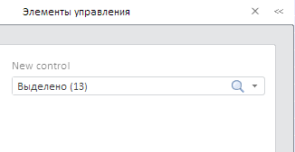

# ControlBarView.add

ControlBarView.add
-

# ControlBarView.add

## Синтаксис

add (prxControl: PP.Prx.[Control](../Control/Control.htm),
 toNode: Boolean))

## Параметры

prxControl. Элемент
 управления, который будет добавлен на панель;

toNode. Определяет,
 будет ли элемент управления добавлен в DOM-вершину: true -
 будет, false
 - не будет.

## Описание

Метод add добавляет элемент
 управления на панель.

## Пример

Для выполнения примера предполагается наличие на html-странице компонента
 [ReportBox](../../../Components/RegularReport/ReportBox/ReportBox.htm)
 с наименованием «reportBox» (см. «[Пример
 размещения компонента ReportBox](../../../Components/RegularReport/ReportBox/ReportBox_Example.htm)»). Исходный регламентный отчет должен
 содержать как минимум один элемент управления. Первый элемент управления
 должен быть экземпляром класса PP.Prx.Ui.[DimComboControlView](../DimComboControlView/DimComboControlView.htm).
 Удалим все элементы управления с панели и добавим в нее элемент управления,
 соответствующий первому элементу управления отчета:

        ctrl = PP.Prx.Ui.PrxControl.create({
            Source: prxReport.getControls()[0],
            Report: reportBox.getSource(),
            Service: prxMbService
        });
        ctrl.MetadataChanged.add(function (sender, args) {
            console.log(args.Args._Metadata.dimMeta.data.selection.selectedCount)
        });
        ctrl.setName("New control");
        ctrl.getLabel().setEnabled(false);
         controlBar = reportBox.getDataView().getControlBar();
        controlBar.clear(true);
        controlBar.add(ctrl, true);
После выполнения примера будет очищена панель элементов регламентного
 отчета и в нее будет добавлен элемент управления, соответствующий первому
 элементу управления отчета. Для элемента управления будет установлено
 имя «New control», подпись будет деактивирована:

 При изменении отметки в элементе управления в консоль будет выводиться
 количество отмеченных элементов управления.

См. также:

[ControlBarView](ControlBarView.htm)

		Справочная
		 система на версию 10.9
		 от 18/08/2025,
		 © ООО «ФОРСАЙТ»,
