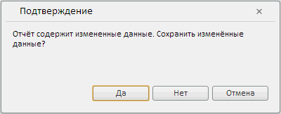

# Конструктор DataSaveDialog

Конструктор DataSaveDialog
-

# Конструктор DataSaveDialog

## Синтаксис

PP.Prx.Ui.DataSaveDialog(settings);

## Параметры

settings. JSON-объект с настройками компонента.

## Описание

Конструктор DataSaveDialogsettings создает диалог для сохранения измененных данных.

## Пример

Для выполнения примера теге HEAD добавьте ссылки на следующие js-и css-файлы:

-
PP.js;

-
PP.css;

-
PP.Metabase.js;

-
PP.Report.js;

-
PP.Report.css;

-
resources.ru.js

В теге BODY добавьте элемент DIV с идентификатором «btn1».

Добавьте следующий java-script код:

    //устанавливаем текущую культуру
    PP.setCurrentCulture(PP.Cultures.ru);
    //создаем подключение к метабазе
    metabase = new PP.Mb.Metabase({
        Id: "WAREHOUSE",
        UserCreds: { UserName: "user", Password: "password" }
    });
    //открываем метабазу
    metabase.open();
    //создаем сервис для работы с регламентными отчетами
    prxMbService = new PP.Prx.PrxMdService({ Metabase: metabase });
    //открываем регламентный отчет по ключу
    prxReport = prxMbService.open(699099);
    var saveDataDialog = new PP.Prx.Ui.DataSaveDialog();
    function ShowDialog() {
        saveDataDialog.show(10, 30)
    }
    var btn = new PP.Ui.Button({
        ParentNode: document.getElementById("btn1"),
        Click: ShowDialog,
        Content: "Открыть"
    })

После выполнения примера на странице будет размещена кнопка «Открыть», при нажатии на которую будет открываться следующий диалог:

См. также:

[DataSaveDialog](DataSaveDialog.htm)

		Справочная
		 система на версию 10.9
		 от 18/08/2025,
		 © ООО «ФОРСАЙТ»,
