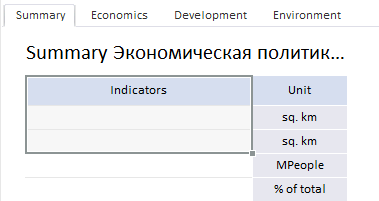

# PP.Prx.Ui.GridView.Selection

PP.Prx.Ui.GridView.Selection
-

# GridView.Selection

## Синтаксис

Selection: Object

## Описание

Свойство Selection устанавливает
 диапазон выделенных ячеек таблицы.

## Пример

Для выполнения примера предполагается наличие на html-странице области
 данных с наименованием «[dataArea](../../../Components/RegularReport/DataArea/DataArea.htm)»
 (cм. «[Пример
 размещения компонента DataArea](../../../Components/RegularReport/DataArea/DataArea_Example.htm)»). Создадим функцию

function
 selectCells() {

dataArea().getGridView().setSelection(JSON.parse('{"type":"Normal","range":{"left":0,"top":0,"height":0,"width":0,"parts":{"it":[{"left":1,"top":1,"width":1,"height":3,"type":"Cells"}]},"type":"MultiPart"}}'))

}

После выполнения функции selectCells
 будет выделен диапазон из трех ячеек таблицы:

См. также:

[GridView](GridView.htm)

		Справочная
		 система на версию 10.9
		 от 18/08/2025,
		 © ООО «ФОРСАЙТ»,
