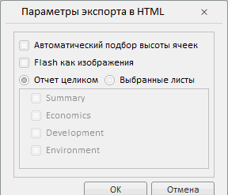

# Конструктор HtmlExportDialog

Конструктор HtmlExportDialog
-

# Конструктор HtmlExportDialog

## Синтаксис

PP.Prx.Ui.HtmlExportDialog (settings)

## Параметры

settings. JSON-объект с настройками компонента.

## Описание

Конструктор HtmlExportDialog создает диалог для экспорта отчета в формат *.html.

## Пример

Для выполнения примера теге HEAD добавьте ссылки на следующие js-и css-файлы:

-
PP.js;

-
PP.css;

-
PP.Metabase.js;

-
PP.Report.js;

-
PP.Report.css;

-
resources.ru.js.

Добавьте следующий java-script код:

    var htmlExpDialog = new PP.Prx.Ui.HtmlExportDialog();
    function ShowDialog() {
        htmlExpDialog.show(10, 30)
        }
    var btn = new PP.Ui.Button({
            ParentNode: document.getElementById("btn1"),
            Click: ShowDialog,
            Content: "Открыть"
        })

После выполнения примера на странице будет размещена кнопка «Открыть», при нажатии на которую будет открываться следующий диалог:

См. также:

[HtmlExportDialog](HtmlExportDialog.htm)

		Справочная
		 система на версию 10.9
		 от 18/08/2025,
		 © ООО «ФОРСАЙТ»,
