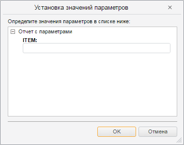

# ParamsDialog.Params

ParamsDialog.Params
-

# ParamsDialog.Params

## Синтаксис

Params: Array of PP.Mb.[Param](dhtmlMetabase.chm::/Classes/Metabase/Param/Param.htm)

## Описание

Свойство Params устанавливает
 параметры отчета, которые будут отображаться в диалоге.

## Пример

Для выполнения примера на страницу, созданную в рамках примера для [конструктора
 ParamView](dhtmlMetabase.chm::/Classes/Metabase/ParamView/Constructor_ParamView.htm) добавьте ссылку на библиотеку PP.Report.js. В тело функции
 onEaxReady добавьте следующий
 код:

but = new
 PP.Ui.Button({

    Content: "Редактировать
 параметры",

    ParentNode: document.body,

    Click: function (sender,
 args) {

        paramD
 = new PP.Prx.Ui.ParamsDialog({

            Params:
 eaxAnalyzer.getParams()

        });

        paramD.show();

    }

});

После выполнения примера на странице будет размещена кнопка «Редактировать
 параметры», при нажатии на которую будет открыт диалог для редактирования
 значений параметров отчета:

См. также:

[ParamsDialog](ParamsDialog.htm)

		Справочная
		 система на версию 10.9
		 от 18/08/2025,
		 © ООО «ФОРСАЙТ»,
