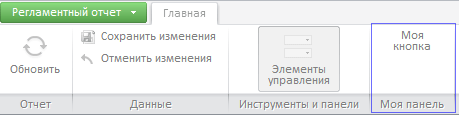

# ReportView.RibbonView

ReportView.RibbonView
-

# ReportView.RibbonView

## Синтаксис

RibbonView: PP.Ui.Prx.[RibbonView](../RibbonView/RibbonView.htm)

## Описание

Свойство RibbonView определяет
 [ленту инструментов](../RibbonView/RibbonView.htm) регламентного
 отчета.

## Комментарии

Представление ленты инструментов возвращается при помощи метода getRibbonView (см. Пример 1) или
 из JSON-объекта при создании компонента
 [ReportBox](../ReportBox/Constructor_ReportBox.htm) (см. Пример
 2).

## Пример 1

Для выполнения примера предполагается наличие на html-странице компонента
 [ReportBox](../../../Components/RegularReport/ReportBox/ReportBox.htm)
 с наименованием «reportBox» (см. «[Пример
 размещения компонента ReportBox](../../../Components/RegularReport/ReportBox/ReportBox_Example.htm)»). Добавим на вкладку ленты инструментов
 новую группу кнопок, в которой содержится одна кнопка:

        reportBox.getRibbonView().getControl().getCategory(0).addPanel(new PP.Ui.RibbonPanel({
            Elements: [new PP.Ui.RibbonButton({
                Content: "Моя кнопка"
            })],
            Caption: "Моя панель"
        }));

После выполнения примера на ленту регламентного отчета будет добавлена
 новая группа кнопок с одной новой кнопкой:

## Пример 2

Для выполнения примера необходимо, чтобы на html-странице был создан
 сервис для работы с регламентными отчетами - prxMbService, было
 осуществлено подключение к метабазе и открыт регламентный отчет -prxReport
 (см. «[Пример
 размещения компонента ReportBox](../../../Components/RegularReport/ReportBox/ReportBox_Example.htm)»). В корневой папке приложения должна
 содержаться папка с пиктограммами «PP_Img». Создадим компонент [ReportBox](../../../Components/RegularReport/ReportBox/ReportBox.htm),
 для ленты инструментов добавим обработчик события нажатия пункта главного
 меню «[Закрыть](../RibbonView/RibbonView.Closed.htm)»:

    var reportBox = new PP.Prx.Ui.ReportBox({
        ParentNode: "ReportBox",
        Source: prxReport,
        Service: prxMbService,
        ImagePath: "/PP_img/",
        RibbonView: {
            Closed: function () {
                reportBox.setSource(null);
            }
        }
    });

После выполнения примера на html-странице будет создан компонент [ReportBox](../../../Components/RegularReport/ReportBox/ReportBox.htm).
 При нажатии на пункт главного меню «Закрыть» будет закрыт текущий регламентный
 отчет.

См. также:

[ReportView](ReportView.htm)
 | [Ribbon](dhtmlRibbon.chm::/Classes/Ribbon/Ribbon.htm)

		Справочная
		 система на версию 10.9
		 от 18/08/2025,
		 © ООО «ФОРСАЙТ»,
