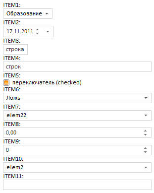

# Пример размещения компонента ControlBar

Пример размещения компонента ControlBar
-

# Пример размещения компонента ControlBar

Для выполнения примера создайте html-страницу и выполните следующие действия:

1. В теге HEAD добавьте ссылки на следующие js-и css-файлы:

-
PP.js;

-
PP.Metabase.js;

-
PP.Report.js;

-
resources.ru;

-
PP.css;

-
PP.Report.css.

2. В теге SCRIPT добавьте следующий скрипт:

        var metabase, prxReport, prxMbService, controlBar;
        function renderReport() {
            metabase = new PP.Mb.Metabase(//создаем подключение к метабазе
	     {
	         PPServiceUrl: "PPService.axd?action=proxy",
	         Id: "WAREHOUSE",
	         UserCreds: { UserName: "user", Password: "password" }
	     });
            metabase.open();//открываем метабазу
            prxMbService = new PP.Prx.PrxMdService({ Metabase: metabase });//создаем сервис для работы с регламентными отчетами
            prxReport = prxMbService.open(731737);//открываем отчет из метабазы по ключу
            controlBar = new PP.Prx.Ui.ControlBar(//создаем панель элементов управления
	     {
	         ParentNode: "controlBar",
	         Source: prxReport,//источник панели элементов управления
	         Service: prxMbService,
	         Width: 300
	     });
        }

3. В тег BODY добавьте следующий код:

<body onselectstart="return false" onload="renderReport()" style="height: 100%;">

    

    

</body>

После выполнения примера на html-странице будет размещен компонент [ControlBar](ControlBar.htm), имеющий следующий вид:

Количество отображаемых элементов управления и их вид зависят от настроек отчета-источника.

См. также:

[ControlBar](ControlBar.htm)

		Справочная
		 система на версию 10.9
		 от 18/08/2025,
		 © ООО «ФОРСАЙТ»,
