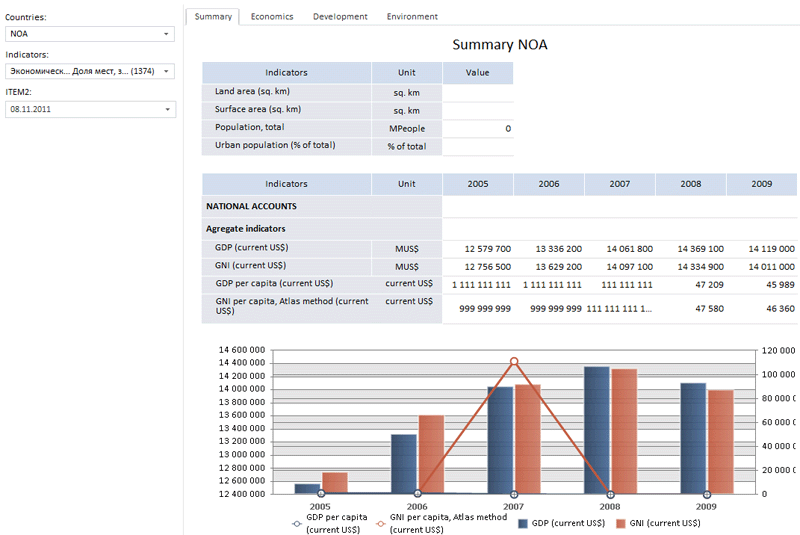

# Пример размещения компонента DataArea

Пример размещения компонента DataArea
-

# Пример размещения компонента DataArea

Для выполнения примера создайте html-страницу и выполните следующие действия:

1. В теге HEAD добавьте ссылки на следующие js- и css-файлы:

-
PP.js;

-
PP.Metabase.js;

-
PP.Report.js;

-
resources.ru;

-
PP.css;

-
PP.Report.css.

2. В теге SCRIPT добавьте следующий скрипт:

    var metabase, prxReport, prxMbService, dataArea;
    function renderReport() {
        metabase = new PP.Mb.Metabase(//создаем соединение с метабазой
		{
		    PPServiceUrl: "PPService.axd?action=proxy",
		    Id: "WAREHOUSE",
		    UserCreds: { UserName: "user", Password: "password" }
		});
        metabase.open();//открываем метабазу
        prxMbService = new PP.Prx.PrxMdService({ Metabase: metabase });//создаем сервис для работы с регламентными отчетами
        prxReport = prxMbService.open(699099);//открываем отчет из метабазы по ключу
        dataArea = new PP.Prx.Ui.DataArea(
		{
		    ParentNode: "dataArea",
		    Source: prxReport,//указываем отчет-источник
		    Service: prxMbService
		});
        window.onresize();
    }
    var idTime;
    //функция для изменения размера компонента при изменении размера контейнера
    window.onresize = function updateSize() {
        if (idTime)
            clearTimeout(idTime);
        idTime = setTimeout(function () {
            if (dataArea)
                dataArea.setSize(document.getElementById("dataArea").offsetWidth - 2, 800);
            idTime = null;
        }, 50);
    };

3. В тег BODY добавьте следующий код:

<body onselectstart="return false" onload="renderReport()" style="height: 100%;">

    

    

</body>

После выполнения примера на html-странице будет размещен компонент [DataArea](DataArea.htm), имеющий следующий вид:

Внешний вид [области данны](DataArea.htm)х зависит от отчета-источника. Если в отчете нет элементов управления, панель элементов управления не будет отображаться на области данных. Графики отображаются как изображение.

См. также:

[DataArea](DataArea.htm)

		Справочная
		 система на версию 10.9
		 от 18/08/2025,
		 © ООО «ФОРСАЙТ»,
