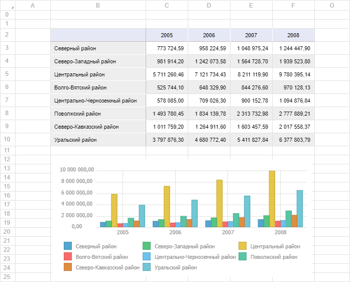

# Пример размещения компонента GridBox

Пример размещения компонента GridBox
-

# Пример размещения компонента GridBox

Перед выполнением примера ознакомьтесь с [рекомендациями](dhtml.chm::/specification/JavaScript_main.htm)
 к написанию кода. Убедитесь, что в репозитории содержится регламентный
 отчёт с ключом «11775».

Для создания компонента GridBox
 используйте HTML-код:

<!DOCTYPE html PUBLIC "-//W3C//DTD XHTML 1.0 Transitional//EN" "http://www.w3.org/TR/xhtml1/DTD/xhtml1-transitional.dtd">
<html>
<head>
    <title>GridBox</title>
    
    <link href="../build/PP.css" type="text/css" rel="stylesheet" />
    
    
    

    
</head>
<body onload="viewGrid()">
</body>
</html>

В результате выполнения примера на html-странице будет размещен компонент
 GridBox, на котором содержится
 табличный лист регламентного отчёта:

На табличном листе доступно изменение значений в ячейках таблицы. Диаграммы
 и карты отображаются в виде изображений и недоступны для редактирования.

См. также:

[GridBox](GridBox.htm)
 |[DataArea](../DataArea/DataArea.htm)

		Справочная
		 система на версию 10.9
		 от 18/08/2025,
		 © ООО «ФОРСАЙТ»,
