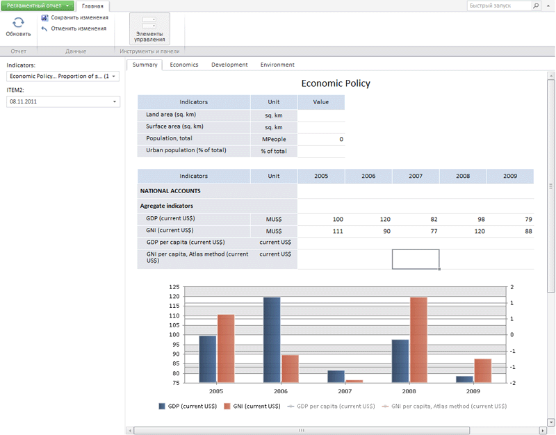

# Пример размещения компонента ReportBox

Пример размещения компонента ReportBox
-

# Пример размещения компонента ReportBox

Для выполнения примера создайте html-страницу и выполните следующие
 действия:

1. В теге HEAD добавьте ссылки на следующие js-и css-файлы:

	- PP.js;

	- PP.css;

	- PP.App.css;

	- PP.Metabase.css;

	- PP.Report.css;

	- PP.Metabase.js;

	- PP.Report.js;

	- PP.App.js.

2. В теге SCRIPT добавьте следующий скрипт:

Примечание.
 Компонент ReportBox с подписками на события главного меню «Отчёт» реализуется
 при помощи компонента [PP.App.init](dhtmlApp.chm::/Classes/App/PP.App.init.htm)
 или конструктора [PP.Application.PrxModuleObject](dhtmlApp.chm::/Classes/Application/PrxModuleObject/Constructor_PrxModuleObject.htm).

Замените в скрипте строки создания компонента ReportBox для использования
 PP.App.init :

PP.App.init(PP.App.ModuleType.Reporter, { Metabase: {IsMbOpened: true}, Module: {
    Source : prxReport,
    Service : prxMbService,
    },
    ParentNode: document.body });
Для использования PP.App.PrxModuleObject:

var moduleObject = new PP.App.PrxModuleObject({"Source":prxReport, "Service": prxMbService, "ParentNode":document.body});
reportBox = moduleObject.getReportBox();
3. В тег BODY добавьте следующий код:

<body  onload="renderReport()">
</body>
После выполнения примера на html-странице будет размещен компонент [ReportBox](ReportBox.htm), имеющий следующий вид:

См. также:

[ReportBox](ReportBox.htm)

		Справочная
		 система на версию 10.9
		 от 18/08/2025,
		 © ООО «ФОРСАЙТ»,
