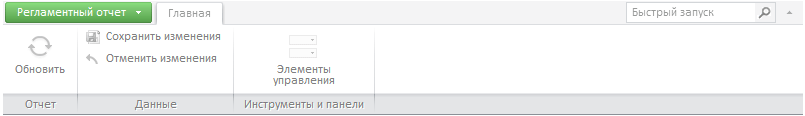

# Пример размещения компонента RibbonView

Пример размещения компонента RibbonView
-

# Пример размещения компонента RibbonView

Для выполнения примера создайте html-страницу и выполните следующие действия:

1. В теге HEAD добавьте ссылки на следующие js- и css-файлы:

-
PP.js;

-
PP.Metabase.js;

-
PP.Report.js;

-
resources.ru;

-
PP.css;

-
PP.Report.css.

2. В теге SCRIPT добавьте следующий скрипт:

	    var metabase, prxReport, prxMbService, ribbon;
	    function renderReport() {
	        metabase = new PP.Mb.Metabase(//Создаем метабазу
		{
		    PPServiceUrl: "PPService.axd?action=proxy",
		    Id: "WAREHOUSE"
		});
	        metabase.open();//Открываем метабазу
	        prxMbService = new PP.Prx.PrxMdService({ Metabase: metabase });//Создаем сервис для работы с регламентными отчетами
	        prxReport = prxMbService.open(731737);//Открываем отчет из метабазы
	        ribbon = new PP.Prx.Ui.RibbonView(
		{
		    ParentNode: "ribbon",
		    Source: prxReport,//Отчет-источник
		    ImagePath: "PP_img/"//Путь к папке с картинками
		});
	    }

3. В тег BODY добавьте следующий код:

<body onselectstart="return false" onload="renderReport()" style="height: 100%;">

    

    

</body>

После выполнения примера на html-странице будет размещен компонент [RibbonView](RibbonView.htm), имеющий следующий вид:

Команды ленты инструментов недоступны, так как отчет не открыт. Если
 компонент [создается в составе
 ReportBox](../ReportBox/ReportBox_Example.htm) (по умолчанию), после открытия отчета кнопки становятся
 активными.

См. также:

[RibbonView](RibbonView.htm)

		Справочная
		 система на версию 10.9
		 от 18/08/2025,
		 © ООО «ФОРСАЙТ»,
