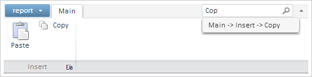

# Ribbon.UseIntellisense

Ribbon.UseIntellisense
-

# Ribbon.UseIntellisense

## Синтаксис

UseIntellisense: Boolean

## Описание

Свойство UseIntellisense определяет
 наличие команд ленты инструментов.

## Комментарии

Допустимые значения:

	- true.
	 Команды будут отображены в ленте инструментов;

	- false.
	 Команды будут отсутствовать в ленте инструментов (по умолчанию).

Значение свойства устанавливается из JSON и с помощью метода setUseIntellisense,
 а возвращается с помощью метода getUseIntellisense.

## Пример

Для выполнения примера предполагается наличие на странице компонента
 [Ribbon](Ribbon.htm) c наименованием «ribbon» (см. «[Пример размещения
 компонента Ribbon из JSON](../../Components/Ribbon/Example_Ribbon_JSON.htm)»). Пример выполняется в консоли браузера.
 Отобразим поле ввода для быстрого запуска операций

// Отображаем поле ввода для быстрого запуска операций
ribbon.setUseIntellisense(true);
После ввода в поле текста «Cop» раскроется меню с предложенными операциями:

Обновляем результаты поиска операций:

// Обновляем результаты поиска операций
ribbon.updateAutoComplete();
Результаты поиска операций будут обновлены.

См. также:

[Ribbon](Ribbon.htm)

		Справочная
		 система на версию 10.9
		 от 18/08/2025,
		 © ООО «ФОРСАЙТ»,
