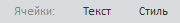

# RibbonCategory.GroupName

RibbonCategory.GroupName
-

# RibbonCategory.GroupName

## Синтаксис

GroupName: String

## Описание

Свойство GroupName устанавливает
 наименование для группы контекстных вкладок.

## Комментарии

Группа контекстных вкладок выглядит следующим образом:

В данном случае «Ячейки:» - название группы контекстных вкладок, «Текст»
 и «Стиль» - заголовки контекстных вкладок, входящих в группу «Ячейки:».

Свойство задается только из JSON.

## Пример

Пример использования свойства приведен на странице «[Пример
 создания компонента Ribbon](../../Components/Ribbon/Example_Ribbon.htm)».

См. также:

[Ribbon](../Ribbon/Ribbon.htm)

		Справочная
		 система на версию 10.9
		 от 18/08/2025,
		 © ООО «ФОРСАЙТ»,
