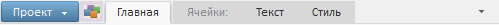
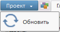

# Пример создания компонента Ribbon

Пример создания компонента Ribbon
-

# Пример создания компонента Ribbon

Для выполнения примера подключите ссылки на библиотеку компонентов PP.js и таблицы визуальных стилей PP.css. Необходимо наличие папки с изображениями «img», находящейся в корневом каталоге проекта. Добавьте в теге BODY элемент DIV с идентификатором «ribbonContainer».

Разместим на html-странице ленту приложения, которая включает в себя:

-
1 вкладку с заголовком «Главная»;

-
1 панель с наименованием «Вставка», которая расположена на вкладке «Главная»;

-
3 кнопки, расположенные на панели «Вставка»;

-
2 контекстные вкладки, объединенные в группу «Ячейки»;

-
1 кнопка на меню быстрого доступа;

-
1 элемент главного меню.

var ribbon = new PP.Ui.Ribbon({
    ParentNode: "ribbonContainer"
});
var cat1 = new PP.Ui.RibbonCategory({
    Caption: "Главная"
});
var pan1 = new PP.Ui.RibbonPanel({
    Caption: "Вставка"
});
var but1 = new PP.Ui.RibbonButton({
    Content: "Вставить",
    ImageUrl: "../../build/img/navigator/ribbon/paste.png",
    Id: "PasteButton"
});
var but2 = new PP.Ui.RibbonButton({
    Content: "Копировать",
    ImageUrl: "../../build/img/navigator/ribbon/copy.png",
    ImagePosition: PP.LTRB.Left,
    Id: "CopyButton"
});
var but3 = new PP.Ui.RibbonButton({
    Content: "Вырезать",
    ImageUrl: "../../build/img/navigator/ribbon/cut.png",
    ImagePosition: PP.LTRB.Left,
    Id: "CutButton"
});
//Добавляем кнопки на панель «Вставка»:
pan1.addControl(but1);
pan1.addControl(but2, true);
pan1.addControl(but3, true);
//Добавляем панель «Вставка» на вкладку «Главная»:
cat1.addPanel(pan1);
//Добавляем вкладку «Главная» на ленту приложения:
ribbon.addCategory(cat1, 3);
//Добавляем кнопку на панель быстрого доступа
ribbon.addQuickAccessControl(new PP.Ui.RibbonButton({
    ImageUrl: "../../build/img/navigator/ribbon/smallIcon.png",
    Id: "QuickButton"
}));
//Лента свернута
ribbon.setIsAutoHiding(true);
//Устанавливаем наименование для кнопки приложения:
ribbon.getMainButton().setContent("Проект"); //Главное меню ленты приложения:
var menu = new PP.Ui.Menu();
menu.addItem(new PP.Ui.MenuItem({
    Content: "Обновить",
    ImageUrl: "../../build/img/navigator/ribbon/refresh.png"
}));
ribbon.setMainMenu(menu);
//Ширина ленты приложения:
ribbon.setWidth(500); //Контекстные вкладки:
ribbon.addCategory(new PP.Ui.RibbonCategory({
    Caption: "Текст",
    GroupName: "Ячейки:"
}), 2);
ribbon.addCategory(new PP.Ui.RibbonCategory({
    Caption: "Стиль",
    GroupName: "Ячейки:"
}), 3);
ribbon.setCategoriesVisibilityByGroupName("Ячейки:", true);

После выполнения примера на html-странице будет размещена лента приложения, имеющая следующий вид:

Чтобы развернуть содержимое вкладок нажмите на кнопку  в правом верхнем углу. Лента приложения приобретет следующий вид:

Кнопка приложения - синяя кнопка в левом верхнем углу с надписью «Проект» содержит раскрывающееся меню - главное меню ленты приложения:

Справа от кнопки приложения располагается панель быстрого доступа. На ней размещена кнопка с изображением.

См. также:

[Ribbon](Ribbon.htm)

		Справочная
		 система на версию 10.9
		 от 18/08/2025,
		 © ООО «ФОРСАЙТ»,
