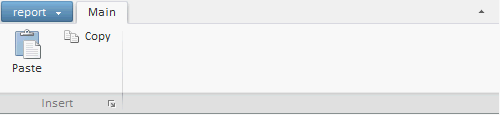
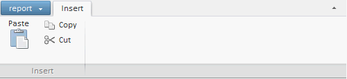

# Пример размещения компонента Ribbon из JSON

Пример размещения компонента Ribbon из JSON
-

# Пример размещения компонента Ribbon из JSON

Лента приложения и ее элементы могут быть созданы и настроены через
 JSON-объект, который задается в параметрах конструктора компонента [Ribbon](Ribbon.htm).

Для выполнения примера на html-страницу добавьте ссылки на библиотеку
 компонентов PP.js и таблицы визуальных стилей PP.css. В корневом каталоге
 должна содержаться папка с изображениями «img». Добавьте в теге BODY элемент
 DIV с идентификатором «simple1».

//Обработчик события Click кнопки запуска
function launchButtonClick()
{
   alert("Кнопка запуска");
}
//Главное меню
var MainMenu = new PP.Ui.Menu();
MainMenu.addItem("Open");
var ribbon = new PP.Ui.Ribbon(
//JSON-объект со свойствами ленты:
{
   MainButton: {
      Content: "report",
      Menu: MainMenu
   }, //Кнопка приложения
   "Categories": //Массив вкладок
   [
   {
      Id: "cat1",
      Caption: "Main",
      "Panels": //Массив панелей вкладки
      [
      { //Кнопка запуска
         LaunchButton: {
            Click: launchButtonClick,
            Content: "Launch"
         },
         Id: "pan1",
         Caption: "Insert",
         "Elements": //Массив элементов управления
         [
         {
            "PPType": "RibbonButton", //Название класса без пространства имен.
            "IsLargeControl": "true", //Определяем размер элемента управления(большой или маленький).
            Id: "but1",
            Content: "Paste",
            ImageUrl: "img/ribbon_img/paste.png"
         },
         {
            "PPType": "RibbonButton",
            "IsLargeControl": "false",
            Id: "but2",
            Content: "Copy",
            ImagePosition: "Left",
            ImageUrl: "img/ribbon_img/copy.png"
         }],
      }]
   }]
});
ribbon.addToNode(document.getElementById("simple1")); //Размещаем ленту
ribbon.setWidth(500); //Ширина ленты

После выполнения примера на html-странице будет размещена [лента
 приложения](Ribbon.htm) со [вкладкой](../../Classes/RibbonCategory/RibbonCategory.htm)
 «Main». На вкладке расположена [панель](../../Classes/RibbonPanel/RibbonPanel.htm)
 «Insert», содержащая 2 кнопки с изображениями: «Paste» (большая) и «Copy»
 (маленькая):

В нижнем правому углу панели располагается кнопка запуска, при нажатии
 на которую выдается сообщение «Кнопка запуска».

Настройки элементов ленты можно изменять из API:

ribbon.getCategoryById("cat1").setCaption("Insert"); //Изменяем заголовок вкладки
var buttton = new PP.Ui.RibbonButton(//Создаем новую кнопку
{
    Content: "Cut",
    ImageUrl: "samle_img/cut.png",
    ImagePosition: PP.LTRB.Left
});
ribbon.getPanelById("pan1").addControl(buttton, true); //Добавляем кнопку
ribbon.getControlById("but1").setImagePosition(PP.LTRB.Bottom); //Изменяем позицию изображения кнопки «Paste»
ribbon.getItems()[0].getPanels()[0].getLaunchButton().dispose(); //Удаляем кнопку запуска
После изменения настроек компонент приобретет
 следующий вид:

См. также:

[Ribbon](Ribbon.htm)

		Справочная
		 система на версию 10.9
		 от 18/08/2025,
		 © ООО «ФОРСАЙТ»,
