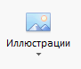
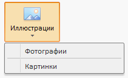

# Пример создания компонента RibbonButton

Пример создания компонента RibbonButton
-

# Пример создания компонента RibbonButton

Для создания компонента [RibbonButton](RibbonButton.htm) необходимо подключить библиотеку PP.js и таблицы визуальных стилей PP.css. Необходимо наличие изображения с наименованием «ImgBtn1.png». Далее приведен javascript-код, позволяющий разместить кнопку ленты приложения на html-странице:

var menu = new PP.Ui.Menu(); //создаем раскрывающееся меню кнопки;
//добавляем элементы меню:
menu.addItem("Фотографии");
menu.addItem(new PP.Ui.Separator());
menu.addItem("Картинки");
var b2 = new PP.Ui.RibbonButton({ //создаем компонент RibbonButton;
   ParentNode: document.getElementById("btn2"),
       Content: "Иллюстрации",
       ImageUrl: "ImgBtn1.png",
       Menu: menu
});

После выполнения примера на html-странице будет размещен компонент RibbonButton, имеющий следующий вид:

При нажатии на кнопку раскроется меню:

См. также:

[RibbonButton](RibbonButton.htm)

		Справочная
		 система на версию 10.9
		 от 18/08/2025,
		 © ООО «ФОРСАЙТ»,
