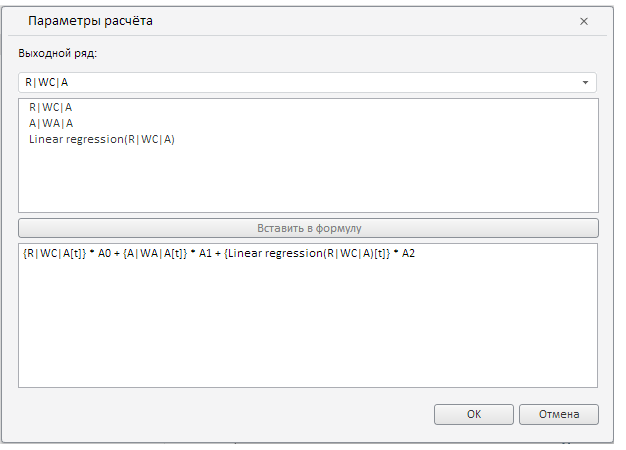

# Конструктор AddNonLinearRegressionDlg

Конструктор AddNonLinearRegressionDlg
-

# Конструктор AddNonLinearRegressionDlg

## Синтаксис

PP.TS.Ui.AddNonLinearRegressionDlg (settings);

## Параметры

settings. JSON-объект со значениями свойств компонента.

## Описание

Конструктор AddNonLinearRegressionDlg создает экземпляр класса [AddNonLinearRegressionDlg](AddNonLinearRegressionDlg.htm).

## Пример

Для выполнения примера предполагается наличие на странице компонента [WorkbookBox](../../../Components/TimeSeries/WorkbookBox/WorkbookBox.htm) с наименованием «workbookBox» (см. «[Пример создания компонента WorkbookBox](../../../Components/TimeSeries/WorkbookBox/Component_WorkbookBox.htm)»), также необходимо в обработчике события открытия документа добавить следующий код:

var setSourceButt = new PP.Ui.Button({
	ParentNode: document.body, //Родительский узел DOM
	Content: "Add Non Linear Regression Dlg", //Текст
	Click: PP.Delegate(onClickSetSource)
});
//Выбираем ряд
var series = wbk.getSeries();
var selectedSeries = [series[0], series[1]];
function onClickSetSource()
	{
		//Создаем экземпляр класса AddNonLinearRegressionDlg
		var dlg = new PP.TS.Ui.AddNonLinearRegressionDlg({
			Source: wbk,
			Data: PP.TS.Ui.FormulaTypeEnum.NonLinearRegression,
			Mode: PP.TS.NonLinearRegressionDlgMode.Add,
			Series: selectedSeries,
			IsRTL: false
		});
		//Отображаем диалог добавления нелинейной регрессии
		dlg.show();
	}

После выполнения примера на html-странице будет размещен компонент [WorkbookBox](../../../Components/TimeSeries/WorkbookBox/WorkbookBox.htm) и кнопка с наименованием «AddNonLinearRegressionDlg» при нажатии на которую выведется диалог добавления нелинейной регрессии:

См. также:

[AddNonLinearRegressionDlg](AddNonLinearRegressionDlg.htm)

		Справочная
		 система на версию 10.9
		 от 18/08/2025,
		 © ООО «ФОРСАЙТ»,
