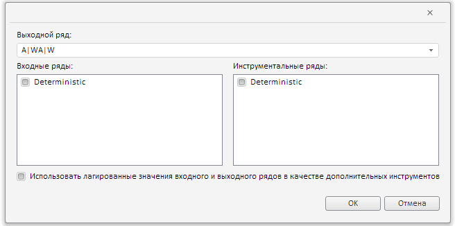

# Конструктор AddSLS2Dialog

Конструктор AddSLS2Dialog
-

# Конструктор AddSLS2Dialog

## Синтаксис

PP.TS.Ui.AddSLS2Dialog (settings);

## Параметры

settings. JSON-объект со значениями
 свойств компонента.

## Описание

Конструктор AddSLS2Dialog создает
 экземпляр класса [AddSLS2Dialog](AddSLS2Dialog.htm).

## Пример

Для выполнения примера в теге HEAD html-страницы укажите ссылки на следующие
 css- и js-файлы:

	- PP.js;

	- PP.Metabase.js;

	- PP.Express.js;

	- PP.TS.js;

	- PP.Express.css;

	- PP.TS.css;

	- PP.Metabase.css;

	- PP.css.

Предполагается наличие рабочей книги с ключом 857804.

В теге <body> в качестве значения атрибута «onLoad» укажите имя
 функции, которая выполняется после окончания загрузки тела страницы:

<body onselectstart="return false" class="PPNoSelect" style="margin: 0px" onload='Ready();'>
</body>

В конце документа вставьте код для установки стилей к вершине «document.body»,
 которые соответствуют операционной системе клиента:

В теге SCRIPT добавьте следующий скрипт:

	
После выполнения примера на html-странице будет размещено окно диалога
 добавления нелинейной регрессии:

См. также:

[AddSLS2Dialog](AddSLS2Dialog.htm)

		Справочная
		 система на версию 10.9
		 от 18/08/2025,
		 © ООО «ФОРСАЙТ»,
