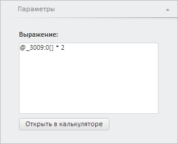

# CalculatorWizardView.CurrentState

CalculatorWizardView.CurrentState
-

**

# CalculatorWizardView.CurrentState

## Синтаксис

CurrentState: Object

## Описание

Свойство CurrentState** определяет текущие настройки мастера калькулятора на [панели параметров](../ParametersPanel/ParametersPanel.htm).

## Комментарии

Значение свойства устанавливается с помощью метода setCurrentState и возвращается с помощью метода getCurrentState. Из JSON значение свойства установить нельзя.

## Пример

Для выполнения примера необходимо наличие на html-странице компонента [WorkbookBox](../../../Components/TimeSeries/WorkbookBox/WorkbookBox.htm) с наименованием «workbookBox» (см. «[Пример создания компонента WorkbookBox](../../../Components/TimeSeries/WorkbookBox/Component_WorkbookBox.htm)»). Установим выражение в мастере калькулятора на панели «Параметры»:

// Получим панель свойств рабочей книги
var propertyBar = workbookBox.getPropertyBarView();
// Получим панель параметров
var parametersPanel = propertyBar.getParametersPanel();
// Отобразим и развернём данную панель
parametersPanel.show();
parametersPanel.expand();
// Получим мастер калькулятора
var calculatorWizard = parametersPanel._CalculatorWizard;
// Получим текущие настройки мастера
var state = calculatorWizard.getCurrentState();
// Зададим временный первый ряд и выражение
state.serie = workbookBox.getSource().getSeries()[0];
state.serie.calc = {
    formula: {
        method: {
            deterministic: {
                expression: "@_3009:0[] * 2", // Выражение
            }
        }
    }
}
// Установим мастеру новые настройки
calculatorWizard.setCurrentState(state);
// Отобразим калькулятор
calculatorWizard.show();

В результате выполнения примера на панели «Параметры» был отображён мастер калькулятора с выражением «@_3009:0[] * 2»:

См. также:

[CalculatorWizardView](CalculatorWizardView.htm)

		Справочная
		 система на версию 10.9
		 от 18/08/2025,
		 © ООО «ФОРСАЙТ»,
