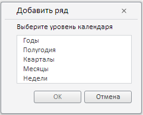

# ChooseFrequencyDialog.getSelectedKey

ChooseFrequencyDialog.getSelectedKey
-

# ChooseFrequencyDialog.getSelectedKey

## Синтаксис

getSelectedKey ();

## Описание

Метод getSelectedKey возвращает
 ключ отмеченного элемента.

## Пример

Для выполнения примера предполагается наличие на странице компонента
 [WorkbookBox](../../../Components/TimeSeries/WorkbookBox/WorkbookBox.htm)
 с наименованием «workbookBox» (см. «[Пример
 создания компонента WorkbookBox](../../../Components/TimeSeries/WorkbookBox/Component_WorkbookBox.htm)»), также необходимо в обработчике
 события открытия документа добавить следующий код:

	var rubKey = wbk.getWbkMetadata().rubrs.def.k;
	tsService.openRub(wbk, rubKey, onOpenRub); //Открываем базу данных временных рядов
	// Обработчик события открытия базы данных временных рядов
	function onOpenRub(sender, args)
	{
		tsService.openDLDim(wbk, onOpenDLDim); //Открываем измерение уровней календаря
	}
	// Обработчик события открытия измерения уровней календаря
	function onOpenDLDim(sender, args)
	{
		var openChooseFrequencyDialogButt = new PP.Ui.Button({
		ParentNode: document.body, //Родительский узел DOM
		Content: "Открыть диалог", //Подпись
		Click: PP.Delegate(onClickOpenChooseFrequencyDialog)
		});
	}
	function onClickOpenChooseFrequencyDialog (){
	var lvlElements = wbk.getDimLvlsEls(); //элементы календарного измерения
	// Создаем экземпляр диалога ChooseFrequencyDialog
	var chooseFrequencyDialog = new PP.TS.Ui.ChooseFrequencyDialog({
		ResourceKey: "ChooseFrequencyDialogTitle", //ключ ресурса
		Width: 250, //ширина
		Height: 200, //высота
		ParentNode: document.body, //родительский узел DOM
		OkButtonClicked: onChooseFrequencyDialogOkButtonClick, //событие нажатия кнопки "ОК"
		Els: lvlElements //элементы календарного измерения
		});
		chooseFrequencyDialog.show(); //Показываем диалог
	}
	// Обработчик события нажатия кнопки "ОК"
	function onChooseFrequencyDialogOkButtonClick(sender, args)
	{
		var newDlg = sender; //экземпляр ChooseFrequencyDialog
		var selKey = newDlg.getSelectedKey();
		//Выводим ключ отмеченного элемента
		alert('Ключ отмеченного элемента: ' + selKey);
	}

После выполнения примера на html-странице будет размещена кнопка с наименованием
 «Открыть диалог». При нажатии на кнопку будет открыт диалог для добавления
 ряда, имеющий следующий вид:

После выбора в списке типа периода в сообщении будет выведен индекс
 выбранного элемента.

См. также:

[ChooseFrequencyDialog](ChooseFrequencyDialog.htm)

		Справочная
		 система на версию 10.9
		 от 18/08/2025,
		 © ООО «ФОРСАЙТ»,
