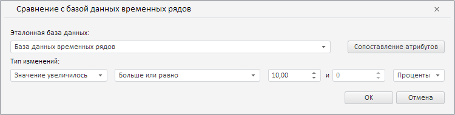

# CrossDatabaseWizard.CurrentState

CrossDatabaseWizard.CurrentState
-

**

# CrossDatabaseWizard.CurrentState

## Синтаксис

CurrentState: Object

## Описание

Свойство CurrentState** определяет текущие настройки мастера правила валидации данных путём их сравнения с базой данных временных рядов.

## Комментарии

Значение свойства устанавливается с помощью метода setCurrentState, а возвращается с помощью метода getCurrentState. Из JSON значение задать нельзя.

## Пример

Для выполнения примера необходимо наличие экземпляра класса [CrossDatabaseWizard](CrossDatabaseWizard.htm) с наименованием «crossDatabaseWizard» (см. «[Конструктор CrossDatabaseWizard](Constructor_CrossDatabaseWizard.htm)»), а также эталонной базы данных с ключом 2031. Определим новые настройки для мастера правила валидации данных путём их сравнения с базой данных временных рядов:

// Определим настройки мастера правила валидации данных путём их сравнения с базой данных временных рядов
var state = {
    comparatorRubKey: 2031, // Ключ эталонной базы данных временных рядов
    // Тип изменений - «Значение увеличилось»
    comparisonType: PP.TS.ValidationRevisionComparisonType.Increase,
    value: {
        // Операция «Больше или равно»
        compOper: PP.TS.ValidationComparisonOperator.MoreOrEqual,
        percentage: true, // Значение представлено в виде процента
        value1: 10 // Первое значение
    }
};
// Применим данные настройки
crossDatabaseWizard.setCurrentState(state);

В результате выполнения примера в данном мастере были установлены тип изменений «Значение увеличилось», операция сравнения «больше или равно» и значение 10, выраженное в процентах:

См. также:

[CrossDatabaseWizard](CrossDatabaseWizard.htm)

		Справочная
		 система на версию 10.9
		 от 18/08/2025,
		 © ООО «ФОРСАЙТ»,
