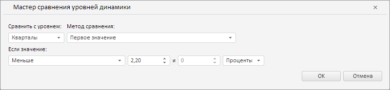

# CrossFrequencyWizard.CurrentState

CrossFrequencyWizard.CurrentState
-

**

# CrossFrequencyWizard.CurrentState

## Синтаксис

CurrentState: Object

## Описание

Свойство CurrentState** определяет текущие настройки мастера для валидации данных путём сравнения уровней динамики их временных рядов.

## Комментарии

Значение свойства устанавливается с помощью метода setCurrentState, а возвращается с помощью метода getCurrentState. Из JSON значение задать нельзя.

## Пример

Для выполнения примера необходимо наличие на html-странице экземпляра класса [CrossFrequencyWizard](CrossFrequencyWizard.htm) с наименованием «crossFrequencyWizard» (см. [конструктор CrossFrequencyWizard](Constructor_CrossFrequencyWizard.htm)). Определим новые настройки для мастера валидации данных путём их сравнения с базой данных временных рядов:

// Определим новые настройки мастера
var state = {
    // Метод сравнения «Первое значение»
    "aggrType": PP.TS.MsCollapseType.First,
    "value": {
        // Операция сравнения «Меньше»
        "compOper": PP.TS.ValidationComparisonOperator.Less,
        "percentage": true, // Значение представлено в виде процентов
        "value1": 2.2 // Первое значение
    },
    // Уровень "Кварталы"
    "fromLevel": PP.TS.Ui.DimCalendarLvl.Quarter
};
// Применим данные настройки
crossFrequencyWizard.setCurrentState(state);

В результате выполнения примера в данном мастере был установлен уровень «Кварталы», метод сравнения «Первое значение» и операция сравнения «Меньше 2,20%»:

См. также:

[CrossFrequencyWizard](CrossFrequencyWizard.htm)

		Справочная
		 система на версию 10.9
		 от 18/08/2025,
		 © ООО «ФОРСАЙТ»,
