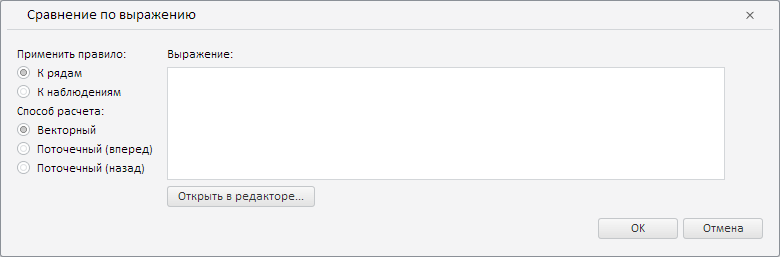

# Конструктор CustomAnalysisWizard

Конструктор CustomAnalysisWizard
-

**

# Конструктор CustomAnalysisWizard

## Синтаксис

PP.TS.Ui.CustomAnalysisWizard(settings: Object);

## Параметры

settings. JSON-объект со значениями свойств класса.

## Описание

Конструктор CustomAnalysisWizard** создаёт экземпляр класса **CustomAnalysisWizard**.

## Пример

Для выполнения примера необходимо наличие на html-странице компонента [WorkbookBox](../../../Components/TimeSeries/WorkbookBox/WorkbookBox.htm) с наименованием «workbookBox» (см. «[Пример создания компонента WorkbookBox](../../../Components/TimeSeries/WorkbookBox/Component_WorkbookBox.htm)»). Создадим и разместим в диалоге мастер для валидации данных путём пользовательского анализа временных рядов в отдельном диалоге:

/* Создадим мастер для валидации данных
   путём пользовательского анализа временных рядов */
var customAnalysisWizard = new PP.TS.Ui.CustomAnalysisWizard({
    Source: workbookBox.getSource() // Источник данных
});
// Получим DOM-дерево для данного мастера
var dom = customAnalysisWizard.getDomNode();
// Установим стиль для мастера
PP.addClass(dom, "PPValidationSettingsDlgContent");
// Разместим созданный мастер в диалоге
var dialog = new PP.Ui.Dialog({
    Caption: "Сравнение по выражению",
    Content: customAnalysisWizard,
    Width: 780, // Ширина диалога
});
// Отобразим диалог
dialog.show();

В результате выполнения примера был создан и размещён в диалоге мастер для валидации данных путём пользовательского анализа временных рядов:

См. также:

[CustomAnalysisWizard](CustomAnalysisWizard.htm)

		Справочная
		 система на версию 10.9
		 от 18/08/2025,
		 © ООО «ФОРСАЙТ»,
