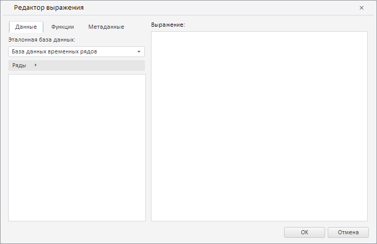
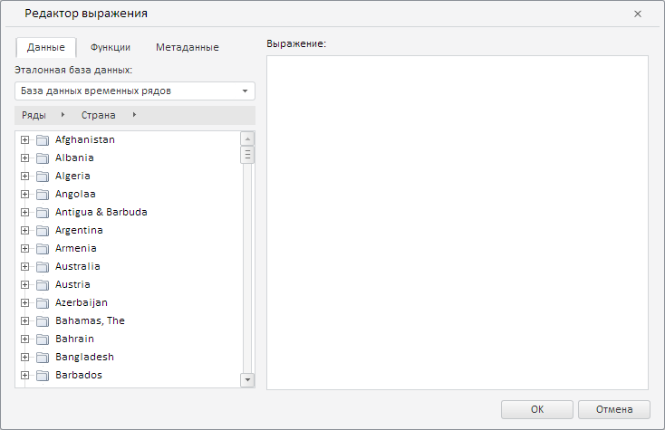

# CustomAnalysisWizard.getExpressionEditorDialog

CustomAnalysisWizard.getExpressionEditorDialog
-

**

# CustomAnalysisWizard.getExpressionEditorDialog

## Синтаксис

getExpressionEditorDialog();

## Описание

Метод getExpressionEditorDialog**
 возвращает редактор выражения.

## Комментарии

Метод возвращает объект типа [PP.TS.Ui.ExpressionEditorDialog](../ExpressionEditorDialog/ExpressionEditorDialog.htm).

## Пример

Для выполнения примера необходимо наличие на html-странице экземпляра
 класса [CustomAnalysisWizard](CustomAnalysisWizard.htm) с наименованием
 «customAnalysisWizard» (см. [конструктор
 CustomAnalysisWizard](Constructor_CustomAnalysisWizard.htm)). Отобразим редактор выражения и обработаем событие
 [RequestMetadata](CustomAnalysisWizard.RequestMetadata.htm):

// Обработаем событие RequestMetadata
customAnalysisWizard.RequestMetadata.add(function (sender, args) {
    console.log("Ключ эталонной базы данных: " + args.getMetadata().RubKey);
});
// Получим редактор выражения
var expressionEditor = customAnalysisWizard.getExpressionEditorDialog();
// Отобразим данный редактор
expressionEditor.show();

В результате выполнения примера был отображён редактор выражения:

При каждом наступлении события [RequestMetadata](CustomAnalysisWizard.RequestMetadata.htm)
 в консоли браузера выводился ключ эталонной базы данных:

Ключ эталонной базы данных: 2031

Теперь установим для полученного редактора выражения иерархию метабазы
 :

// Получим иерархию метабазы
var metaHierarchy = workbookBox.getSource().getHier();
// Установим иерархию метабазы для редактора выражений
customAnalysisWizard.setHierarchy(metaHierarchy, true);
После выполнения примера в редакторе выражения была загружена иерархия
 метабазы:

См. также:

[CustomAnalysisWizard](CustomAnalysisWizard.htm)

		Справочная
		 система на версию 10.9
		 от 18/08/2025,
		 © ООО «ФОРСАЙТ»,
