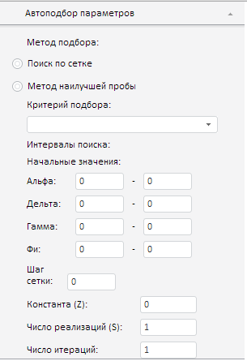

# Конструктор EquationAutoFitPanel

Конструктор EquationAutoFitPanel
-

# Конструктор EquationAutoFitPanel

## Синтаксис

PP.TS.Ui.EquationAutoFitPanel (settings);

## Параметры

settings. JSON-объект со значениями
 свойств компонента.

## Описание

Конструктор EquationAutoFitPanel
 создает экземпляр класса [EquationAutoFitPanel](EquationAutoFitPanel.htm).

## Пример

Для выполнения примера в теге HEAD html-страницы укажите ссылки на следующие
 js- и css-файлы:

	- PP.js;

	- PP.Metabase.js;

	- PP.Express.js;

	- PP.TS.js;

	- PP.css;

	- PP.Express.css;

	- PP.TS.css;

	- PP.Metabase.css.

Также необходимо наличие рабочей книги с ключом 5183.

В теге <body> в качестве значения атрибута «onLoad» укажите имя
 функции, которая выполняется после окончания загрузки тела страницы:

<body onselectstart="return false" class="PPNoSelect" onload="Ready()">
	

</body>

В конце документа вставьте код для установки стилей к вершине «document.body»,
 которые соответствуют операционной системе клиента:

В теге SCRIPT добавьте следующий скрипт:

	

После выполнения примера на html-странице будет размещена панель автоподбора
 параметров экспоненциального сглаживания. Щелкнув по ее заголовку, получим
 панель следующего вида:

См. также:

[EquationAutoFitPanel](EquationAutoFitPanel.htm)

		Справочная
		 система на версию 10.9
		 от 18/08/2025,
		 © ООО «ФОРСАЙТ»,
