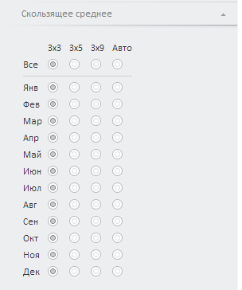

# Конструктор EquationSmoothingSlidingPanel

Конструктор EquationSmoothingSlidingPanel
-

# Конструктор EquationSmoothingSlidingPanel

## Синтаксис

PP.TS.Ui.EquationSmoothingSlidingPanel (settings);

## Параметры

settings. JSON-объект со значениями
 свойств компонента.

## Описание

Конструктор EquationSmoothingSlidingPanel
 создает экземпляр класса [EquationSmoothingSlidingPanel](equationsmoothingslidingpanel.htm).

## Пример

Для выполнения примера в теге HEAD html-страницы укажите ссылки на следующие
 js-файлы:

	- PP.Metabase.js;

	- PP.Express.js;

	- PP.TS.js.

Предполагается наличие базы данных временных рядов и рабочей книги с
 ключами 112 и 5183 соответственно.

Для корректного отображения примера в разных браузерах добавим следующий
 код, задающий подключение css-файлов:

В теге <body> в качестве значения атрибута «onLoad» указываем
 имя функции, которая выполняется после окончания загрузки тела страницы:

<body>
	

</body>

В конце документа вставляем код для установки стилей к вершине
 «document.body», которые соответствуют операционной системе клиента:

В теге SCRIPT добавьте следующий скрипт:

	

После выполнения примера на html-странице будет размещена панель «Скользящее
 среднее» метода «Выделение сезонности (X11)»:

См. также:

[EquationSmoothingSlidingPanel](equationsmoothingslidingpanel.htm)

		Справочная
		 система на версию 10.9
		 от 18/08/2025,
		 © ООО «ФОРСАЙТ»,
