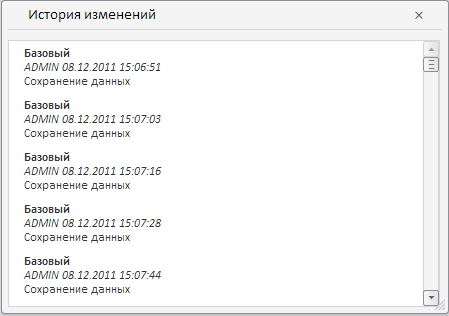

# Конструктор HistoryWindow

Конструктор HistoryWindow
-

# Конструктор HistoryWindow

## Синтаксис

PP.TS.Ui.HistoryWindow (settings);

## Параметры

settings. JSON-объект
 со значениями свойств компонента.

## Описание

Конструктор HistoryWindow создает
 экземпляр класса [HistoryWindow](HistoryWindow.htm).

## Пример

Для выполнения примера в теге HEAD html-страницы укажите ссылки на следующие
 js-файлы:

	- PP.js;

	- PP.Metabase.js;

	- PP.TabSheet.js;

	- PP.Express.js;

	- PP.TS.js.

Также необходимо наличие рабочей книги с
 ключом 5183.

В теге <body> в качестве значения атрибута
 «onLoad» укажите имя функции, которая выполняется после окончания загрузки
 тела страницы:

<body>
	

</body>

В теге SCRIPT добавьте следующий скрипт:

После выполнения примера на html-странице
 будет размещено окно с историей изменений для точки, имеющее
 следующий вид:

См. также:

[HistoryWindow](HistoryWindow.htm)

		Справочная
		 система на версию 10.9
		 от 18/08/2025,
		 © ООО «ФОРСАЙТ»,
