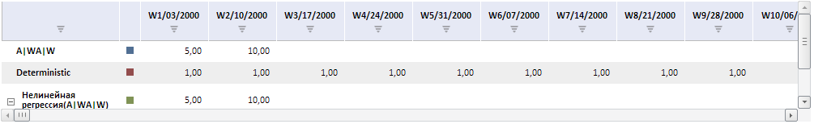

# Конструктор LanerBox

Конструктор LanerBox
-

# Конструктор LanerBox

## Синтаксис

PP.TS.Ui.LanerBox (settings);

## Параметры

settings. JSON-объект
 со значениями свойств компонента.

## Описание

Конструктор LanerBox создает
 экземпляр класса [LanerBox](LanerBox.htm).

## Пример

Для выполнения примера в теге HEAD html-страницы укажите ссылки на следующие js
 и css-файлы:

	- PP.css;

	- PP.Express.css;

	- PP.TS.css;

	- PP.Metabase.css;

	- PP.js;

	- PP.Metabase.js;

	- PP.TabSheet.js;

	- PP.Express.js;

	- PP.TS.js.

Также необходимо наличие рабочей книги с
 ключом 5183.

В теге <body> в качестве значения атрибута
 «onLoad» укажите имя функции, которая выполняется после окончания загрузки
 тела страницы:

<body onload="Ready()">
	

</body>

В конце документа вставьте код для установки
 стилей к вершине «document.body», которые соответствуют операционной системе
 клиента:

В теге SCRIPT добавьте следующий скрипт:

	

После выполнения примера на html-странице
 будет размещена таблица рабочей книги, имеющая следующий вид:

Для всех ячеек будет установлена ширина по
 умолчанию, будет установлен признак обновления отметки.

См. также:

[LanerBox](LanerBox.htm)

		Справочная
		 система на версию 10.9
		 от 18/08/2025,
		 © ООО «ФОРСАЙТ»,
