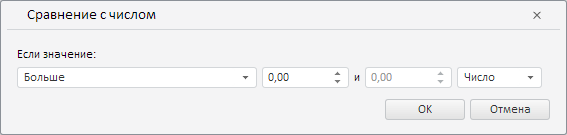

# Конструктор LevelWizard

Конструктор LevelWizard
-

**

# Конструктор LevelWizard

## Синтаксис

PP.TS.Ui.LevelWizard(settings: Object);

## Параметры

settings. JSON-объект со значениями свойств класса.

## Описание

Конструктор LevelWizard** создаёт экземпляр класса **LevelWizard**.

## Пример

Для выполнения примера необходимо наличие на html-странице компонента [WorkbookBox](../../../Components/TimeSeries/WorkbookBox/WorkbookBox.htm) с наименованием «workbookBox» (см. «[Пример создания компонента WorkbookBox](../../../Components/TimeSeries/WorkbookBox/Component_WorkbookBox.htm)»). Создадим и разместим в диалоге мастер правила валидации данных путём их сравнения с числом:

// Создадим мастер правила валидации данных путём их сравнения с числом
var levelWizard = new PP.TS.Ui.LevelWizard();
// Получим DOM-дерево для данного мастера
var dom = levelWizard.getDomNode();
// Установим стиль для мастера
PP.addClass(dom, "PPValidationSettingsDlgContent");
// Разместим созданный мастер в стандартном диалоге
var dialog = new PP.Ui.Dialog({
    Content: levelWizard,
    Width: 567, // Ширина диалога
    Height: 135, // Высота диалога
    // Укажем ключ ресурса для отображения заголовка в диалоге
    ResourceKey: "TSRibbonLevelAnalysisDialog"
});
// Отобразим диалог
dialog.show();

В результате выполнения примера был создан и размещён в диалоге мастер правила валидации данных путём их сравнения с числом:

См. также:

[LevelWizard](LevelWizard.htm)

		Справочная
		 система на версию 10.9
		 от 18/08/2025,
		 © ООО «ФОРСАЙТ»,
