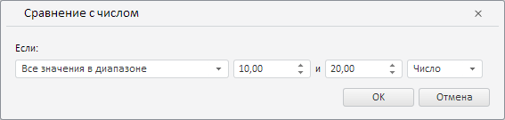

# LevelWizard.CurrentState

LevelWizard.CurrentState
-

**

# LevelWizard.CurrentState

## Синтаксис

CurrentState: Object

## Описание

Свойство CurrentState** определяет текущие настройки мастера правила валидации данных путём их сравнения с числом.

## Комментарии

Значение свойства устанавливается с помощью метода setCurrentState, а возвращается с помощью метода getCurrentState. Из JSON значение задать нельзя.

## Пример

Для выполнения примера необходимо наличие на html-странице экземпляра класса [LevelWizard](LevelWizard.htm) с наименованием «levelWizard» (см. «[Конструктор LevelWizard](Constructor_LevelWizard.htm)»). Определим новые настройки для мастера правила валидации данных путём их сравнения с числом:

// Определим настройки мастера
var state = {
    // Операция «Все значения в диапазоне»
    compOper: PP.TS.ValidationComparisonOperator.Between,
    value1: 10, // Первое значение
    value2: 20 // Второе значение
};
// Изменим вступительный текст правила
levelWizard.getIfValueLabel().setContent("Если:");
// Применим данные настройки
levelWizard.setCurrentState(state);

В результате выполнения примера в данном мастере было определено правило, признающее корректными все значения в диапазоне от 10 до 20, а также для раскрывающегося списка для выбора условия была установлена подпись «Если»:

См. также:

[LevelWizard](LevelWizard.htm)

		Справочная
		 система на версию 10.9
		 от 18/08/2025,
		 © ООО «ФОРСАЙТ»,
