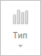

# MainCatView.getChartTypeButton

MainCatView.getChartTypeButton
-

# MainCatView.getChartTypeButton

## Синтаксис

getChartTypeButton();

## Описание

Метод getChartTypeButton возвращает кнопку «Тип» в группе «Диаграмма».

## Комментарии

Метод возвращает объект типа PP.Ui.[RibbonButton](dhtmlRibbon.chm::/Classes/RibbonButton/RibbonButton.htm).

## Пример

Для выполнения примера необходимо наличие на html-странице компонента [WorkbookBox](../../../Components/TimeSeries/WorkbookBox/WorkbookBox.htm) с наименованием «workbookBox» (см. «[Пример создания компонента WorkbookBox](../../../Components/TimeSeries/WorkbookBox/Component_WorkbookBox.htm)»). Сделаем недоступной кнопку «Тип» в группе «Диаграмма» на главной вкладке ленты инструментов:

// Получим ленту инструментов
var ribbon = workbookBox.getRibbonView();
// Получим вкладку «Главная»
var mainCatView = ribbon.getMainCategory();
// Получим кнопку «Тип» в группе «Диаграмма» на главной вкладке
var cTypeButton = mainCatView.getChartTypeButton();
// Сделаем данную кнопку недоступной
cTypeButton.setEnabled(false);

В результате выполнения примера кнопка «Тип» в группе «Диаграмма» стала недоступной:

См. также:

[MainCatView](MainCatView.htm)

		Справочная
		 система на версию 10.9
		 от 18/08/2025,
		 © ООО «ФОРСАЙТ»,
