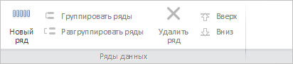

# MainCatView.getInsertButton

MainCatView.getInsertButton
-

# MainCatView.getInsertButton

## Синтаксис

getInsertButton();

## Описание

Метод getInsertButton возвращает
 кнопку «Добавить ряд».

## Комментарии

Метод возвращает объект типа PP.Ui.[RibbonButton](dhtmlRibbon.chm::/Classes/RibbonButton/RibbonButton.htm).

## Пример

Для выполнения примера необходимо наличие на html-странице компонента
 [WorkbookBox](../../../Components/TimeSeries/WorkbookBox/WorkbookBox.htm)
 с наименованием «workbookBox» (см. «[Пример
 создания компонента WorkbookBox](../../../Components/TimeSeries/WorkbookBox/Component_WorkbookBox.htm)»). Переименуем все кнопки, расположенные
 на панели «Ряды данных» вкладки «Таблица»:

// Получим ленту инструментов
var ribbon = workbookBox.getRibbonView();
// Получим вкладку «Главная»
var mainCatView = ribbon.getMainCategory();
// Получим кнопку «Добавить ряд»
var insertButton = mainCatView.getInsertButton();
// Получим кнопку «Группировать»
var groupSeriesButton = mainCatView.getGroupSeriesButton();
// Получим кнопку «Разгруппировать»
var ungroupSeriesButton = mainCatView.getUngroupSeriesButton();
// Получим кнопку «Удалить»
var removeButton = mainCatView.getRemoveButton();
// Определим новое название для всех полученных кнопок
insertButton.setContent("Новый ряд");
groupSeriesButton.setContent("Группировать ряды");
ungroupSeriesButton.setContent("Разгруппировать ряды");
removeButton.setContent("Удалить ряд");
// Определим ключ каталога показателей нового источника данных
var rubKey = 2032;
mainCatView.changeSource(rubKey, "Тест", false);
// Обновим вкладку «Главная» ленты инструментов
mainCatView.refreshAll();
В результате выполнения примера все кнопки, расположенные на панели
 «Ряды данных» вкладки «Таблица», были переименованы:

См. также:

[MainCatView](MainCatView.htm)

		Справочная
		 система на версию 10.9
		 от 18/08/2025,
		 © ООО «ФОРСАЙТ»,
