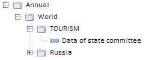

# Конструктор MetaAttributeTree

Конструктор MetaAttributeTree
-

# Конструктор MetaAttributeTree

## Синтаксис

MetaAttributeTree(settings);

## Параметры

settings. JSON-объект со значениями
 свойств компонента.

## Описание

Конструктор MetaAttributeTree
 создает экземпляр класса [MetaAttributeTree](MetaAttributeTree.htm).

## Пример

Для выполнения примера в теге HEAD html-страницы укажите ссылки на следующие
 *.js- и *.css-файлы:

	- PP.css

	- PP.js;

	- PP.Metabase.js;

	- PP.Express.js;

	- PP.TS.js.

Предполагается наличие в репозитории базы данных временных рядов с ключом
 112.

В теге BODY разместите следующий код:

<body>
	

</body>

В теге SCRIPT добавьте скрипт для создания компонента [MetaAttributeTree](../../../Components/TimeSeries/MetaAttributeTree/MetaAttributeTree.htm):

После выполнения примера на html-странице будет размещен компонент [MetaAttributeTree](../../../Components/TimeSeries/MetaAttributeTree/MetaAttributeTree.htm),
 представляющий собой дерево временных рядов:

См. также:

[MetaAttributeTree](MetaAttributeTree.htm)

		Справочная
		 система на версию 10.9
		 от 18/08/2025,
		 © ООО «ФОРСАЙТ»,
