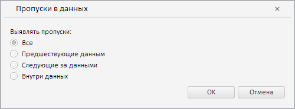

# Конструктор MissingDataWizard

Конструктор MissingDataWizard
-

**

# Конструктор MissingDataWizard

## Синтаксис

PP.TS.Ui.MissingDataWizard(settings: Object);

## Параметры

settings. JSON-объект со значениями свойств класса.

## Описание

Конструктор MissingDataWizard** создаёт экземпляр класса **MissingDataWizard**.

## Пример

Для выполнения примера необходимо наличие на html-странице компонента [WorkbookBox](../../../Components/TimeSeries/WorkbookBox/WorkbookBox.htm) с наименованием «workbookBox» (см. «[Пример создания компонента WorkbookBox](../../../Components/TimeSeries/WorkbookBox/Component_WorkbookBox.htm)»). Создадим и разместим в диалоге мастер для валидации типа «Пропуски в данных»:

// Создадим мастер для валидации типа «Пропуски в данных»
var missingDataWizard = new PP.TS.Ui.MissingDataWizard();
// Получим DOM-дерево для данного мастера
var dom = missingDataWizard.getDomNode();
// Установим стиль для мастера
PP.addClass(dom, "PPValidationSettingsDlgContent");
// Добавим созданный мастер в диалог
var dialog = new PP.Ui.Dialog({
    Caption: "Пропуски в данных",
    Content: missingDataWizard,
    Width: 500 // Ширина диалога
});
// Отобразим данный диалог
dialog.show();

В результате выполнения примера был создан и размещён в диалоге мастер для валидации типа «Пропуски в данных»:

См. также:

[MissingDataWizard](MissingDataWizard.htm)

		Справочная
		 система на версию 10.9
		 от 18/08/2025,
		 © ООО «ФОРСАЙТ»,
