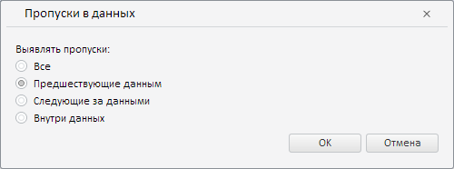

# MissingDataWizard.CurrentState

MissingDataWizard.CurrentState
-

**

# MissingDataWizard.CurrentState

## Синтаксис

CurrentState: Object

## Описание

Свойство CurrentState** определяет текущие настройки мастера для валидации типа «Пропуски в данных».

## Комментарии

Значение свойства устанавливается с помощью метода setCurrentState, а возвращается с помощью метода getCurrentState. Из JSON значение задать нельзя.

## Пример

Для выполнения примера необходимо наличие на html-странице экземпляра класса [MissingDataWizard](MissingDataWizard.htm) с наименованием «missingDataWizard» (см. [конструктор MissingDataWizard](Constructor_MissingDataWizard.htm)). Определим новые настройки для мастера валидации данных путём их сравнения с базой данных временных рядов:

// Определим новые настройки для мастера
var state = {
    // Будем выявлять пропуски, предшествующие данным
    type: PP.TS.ValidationMissingDataType.Leading
};
// Применим данные настройки
missingDataWizard.setCurrentState(state);

В результате выполнения примера в данном мастере было задано выявление пропусков, предшествующие данным:

См. также:

[MissingDataWizard](MissingDataWizard.htm)

		Справочная
		 система на версию 10.9
		 от 18/08/2025,
		 © ООО «ФОРСАЙТ»,
