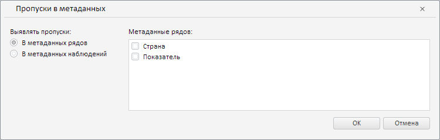

# Конструктор MissingMetadataWizard

Конструктор MissingMetadataWizard
-

**

# Конструктор MissingMetadataWizard

## Синтаксис

PP.TS.Ui.MissingMetadataWizard(settings: Object);

## Параметры

settings. JSON-объект со значениями свойств класса.

## Описание

Конструктор MissingMetadataWizard** создаёт экземпляр класса **MissingMetadataWizard**.

## Пример

Для выполнения примера необходимо наличие на html-странице компонента [WorkbookBox](../../../Components/TimeSeries/WorkbookBox/WorkbookBox.htm) с наименованием «workbookBox» (см. «[Пример создания компонента WorkbookBox](../../../Components/TimeSeries/WorkbookBox/Component_WorkbookBox.htm)»). Создадим и разместим в диалоге мастер для валидации типа «Пропуски в метаданных»:

// Создадим мастер валидации типа "Пропуски в метаданных"
var missingMetadataWizard = new PP.TS.Ui.MissingMetadataWizard({
        Source: workbookBox.getSource()
    });
// Получим DOM-дерево для данного мастера
var dom = missingMetadataWizard.getDomNode();
// Установим стиль для мастера
PP.addClass(dom, "PPValidationSettingsDlgContent");
// Добавим мастер в диалог
var dialog = new PP.Ui.Dialog({
        Caption: "Пропуски в метаданных",
        Content: missingMetadataWizard,
        Width: 750, // Ширина диалога
    });
// Отобразим данный диалог
dialog.show();

В результате выполнения примера был создан и размещён в диалоге мастер для валидации типа «Пропуски в метаданных»:

См. также:

[MissingMetadataWizard](MissingMetadataWizard.htm)

		Справочная
		 система на версию 10.9
		 от 18/08/2025,
		 © ООО «ФОРСАЙТ»,
