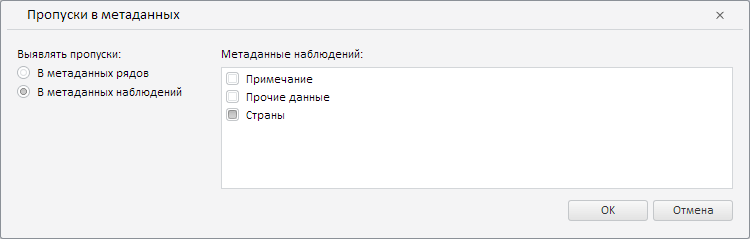

# MissingMetadataWizard.CurrentState

MissingMetadataWizard.CurrentState
-

**

# MissingMetadataWizard.CurrentState

## Синтаксис

CurrentState: Object

## Описание

Свойство CurrentState** определяет текущие настройки мастера для валидации типа «Пропуски в метаданных».

## Комментарии

Значение свойства устанавливается с помощью метода setCurrentState, а возвращается с помощью метода getCurrentState. Из JSON значение задать нельзя.

## Пример

Для выполнения примера необходимо наличие на html-странице экземпляра класса [MissingMetadataWizard](MissingMetadataWizard.htm) с наименованием «missingMetadataWizard» (см. [конструктор MissingMetadataWizard](Constructor_MissingMetadataWizard.htm)). Определим новые настройки для мастера валидации данных путём их сравнения с базой данных временных рядов:

// Определим настройки для мастера
var state = {
    // Пропуски выявляем в метаданных наблюдений
    "calcType": PP.TS.MsCalculationType.Pointwise,
    "attributes": {
        "its": {
            "it": [{
                    /* В качестве метаданных наблюдения
                     укажем атрибут «Страны» */
                    "id": "COUNTRIES", // Идентификатор атрибута
                    "k": 10 // Ключ атрибута
                }
            ]
        }
    }
};
// Применим данные настройки
missingMetadataWizard.setCurrentState(state);

В результате выполнения примера в данном мастере было задано выявление пропусков данных, соответствующих атрибуту наблюдения «Страны»:

См. также:

[MissingMetadataWizard](MissingMetadataWizard.htm)

		Справочная
		 система на версию 10.9
		 от 18/08/2025,
		 © ООО «ФОРСАЙТ»,
