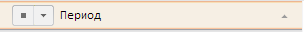
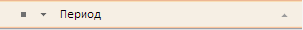

# NavBreadcrumbItem.Selected

NavBreadcrumbItem.Selected
-

# NavBreadcrumbItem.Selected

## Синтаксис

Selected: Array;

## Описание

Свойство Selected возвращает признак, что атрибут отмечен.

## Пример

Для выполнения примера предполагается наличие на странице компонента [WorkbookBox](../../../Components/TimeSeries/WorkbookBox/WorkbookBox.htm) с наименованием «workbookBox» (см. «[Пример создания компонента WorkbookBox](../../../Components/TimeSeries/WorkbookBox/Component_WorkbookBox.htm)»), также необходимо в обработчике события открытия документа добавить следующий код:

	var setSelectedButt = new PP.Ui.Button({
		ParentNode: document.body, //Родительский узел DOM
		Content: "Выделить панель", //Текст
		Click: PP.Delegate(onClickselectAll)
	});

	function onClickselectAll()
	{
		//Получаем компонент для отображения и управления атрибутами рабочей книги, основанный на компоненте PP.Ui.Master
		var navbrCr = workbookBox.getPropertyBarView().getNavBreadcrumb();
		//Получаем панель, содержащую дерево измерения первого атрибута (PP.TS.Ui.NavBreadcrumbItem)
		var navBrCrItem = navbrCr._selfNavItems[0];
		//Устанавливаем или убираем выделение атрибута
		navBrCrItem.getSelected() ? navBrCrItem.setSelected(false) : navBrCrItem.setSelected(true);
	}

После выполнения примера на html-странице будет размещен компонент [WorkbookBox](../../../Components/TimeSeries/WorkbookBox/WorkbookBox.htm) и кнопка с наименованием «Выделить панель». Необходимо выбрать одну из вершин дерева иерархии каталога показателей, а затем нажать на кнопку «Выделить панель». После этого будет получена панель, содержащую дерево измерения первого атрибута и будет установлено/скрыто выделение атрибута:

Выделение установлено:

Выделение скрыто:

См. также:

[NavBreadcrumbItem](NavBreadcrumbItem.htm)

		Справочная
		 система на версию 10.9
		 от 18/08/2025,
		 © ООО «ФОРСАЙТ»,
