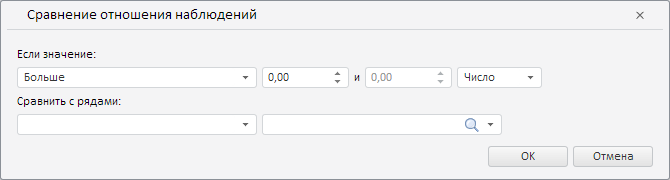

# Конструктор RatioWizard

Конструктор RatioWizard
-

**

# Конструктор RatioWizard

## Синтаксис

PP.TS.Ui.RatioWizard(settings: Object);

## Параметры

settings. JSON-объект со значениями свойств класса.

## Описание

Конструктор RatioWizard** создаёт экземпляр класса [RatioWizard](RatioWizard.htm).

## Пример

Для выполнения примера необходимо наличие на html-странице компонента [WorkbookBox](../../../Components/TimeSeries/WorkbookBox/WorkbookBox.htm) с наименованием «workbookBox» (см. «[Пример создания компонента WorkbookBox](../../../Components/TimeSeries/WorkbookBox/Component_WorkbookBox.htm)»). Создадим и разместим в диалоге мастер для валидации данных путём сравнения отношения наблюдений:

/* Создадим мастер для валидации данных
   путём сравнения отношений наблюдений */
var ratioWizard = new PP.TS.Ui.RatioWizard({
    Source: workbookBox.getSource() // Источник данных
});
// Получим DOM-дерево для данного мастера
var dom = ratioWizard.getDomNode();
// Установим стиль для мастера
PP.addClass(dom, "PPValidationSettingsDlgContent");
// Добавим созданный мастер в диалог
var dialog = new PP.Ui.Dialog({
    Caption: "Сравнение отношения наблюдений", // Заголовок диалога
    Content: ratioWizard, // Содержимое диалога
    Width: 670, // Ширина диалога
    Height: 180 // Высота диалога
});
// Отобразим данный диалог
dialog.show();

В результате выполнения примера был создан и размещён в диалоге мастер для валидации данных путём сравнения отношения наблюдений:

См. также:

[RatioWizard](RatioWizard.htm)

		Справочная
		 система на версию 10.9
		 от 18/08/2025,
		 © ООО «ФОРСАЙТ»,
