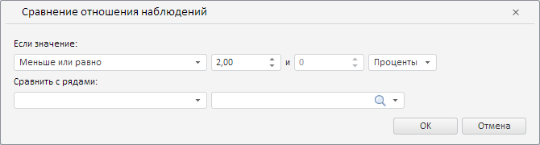

# RatioWizard.CurrentState

RatioWizard.CurrentState
-

**

# RatioWizard.CurrentState

## Синтаксис

CurrentState: Object

## Описание

Свойство CurrentState** определяет текущие настройки мастера для валидации данных путём сравнения отношения наблюдений.

## Комментарии

Значение свойства устанавливается с помощью метода setCurrentState, а возвращается с помощью метода getCurrentState. Из JSON значение задать нельзя.

## Пример

Для выполнения примера необходимо наличие на html-странице экземпляра класса [RatioWizard](RatioWizard.htm) с наименованием «ratioWizard» (см. «[Конструктор RatioWizard](Constructor_RatioWizard.htm)»). Определим новые настройки для рассматриваемого мастера:

// Определим новые настройки мастера
var state = {
    value: {
        /* Укажем операцию сравнения «Меньше или равно» */
        "compOper": PP.TS.ValidationComparisonOperator.LessOrEqual,
        "percentage": true, // Значение укажем в процентах
        "value1": 2 // Первое значение в процентах
    }
};
// Применим данные настройки
ratioWizard.setCurrentState(state);

В результате выполнения примера в рассматриваемом мастере было установлено условие «меньше или равно 2%»:

См. также:

[RatioWizard](RatioWizard.htm)

		Справочная
		 система на версию 10.9
		 от 18/08/2025,
		 © ООО «ФОРСАЙТ»,
