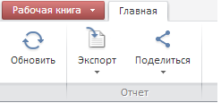
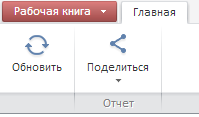

# ReadonlyCatView.getExportButton

ReadonlyCatView.getExportButton
-

# ReadonlyCatView.getExportButton

## Синтаксис

getExportButton ();

## Описание

Метод getExportButton возвращает
 кнопку «Экспорт».

## Пример

Для выполнения примера предполагается наличие на странице компонента
 [WorkbookBox](../../../Components/TimeSeries/WorkbookBox/WorkbookBox.htm)
 с наименованием «workbookBox» (см. «[Пример
 создания компонента WorkbookBox](../../../Components/TimeSeries/WorkbookBox/Component_WorkbookBox.htm)»). Необходимо открыть источник экспресс-отчета
 на просмотр при помощи метода [openDocument](dhtmlExpress.chm::/Classes/Express/EaxMdService/EaxMdService.openDocument.htm)
 и в обработчике события открытия документа добавить следующий код:

	//Возвращаем вкладку ленты «Главная» в режиме просмотра
	var readonlyCat = workbookBox.getRibbonView().getReadonlyCategory();

	////Возвращаем вкладку ленты «Экспорт» в режиме просмотра
	var exportButton = readonlyCat.getExportButton();
	var state = true;
	var exportButtonButtonToggle = new PP.Ui.Button({
		ParentNode: document.body, //родительский узел DOM
		Content: "Показать/скрыть кнопку", //текст
		Click: PP.Delegate(toggleExportButton)
	});
	function toggleExportButton()
	{
		//Показываем или скрываем кнопку «Экспорт»
		state ? exportButton.hide() : exportButton.show();
		state = !state;
	}

После выполнения примера на html-странице будет размещен компонент [WorkbookBox](../../../Components/TimeSeries/WorkbookBox/WorkbookBox.htm)
 и кнопка с наименованием «Показать/скрыть кнопку». По нажатию на кнопку
 будет отображаться/скрываться кнопка «Экспорт»:

или:

См. также:

[ReadonlyCatView](ReadonlyCatView.htm)

		Справочная
		 система на версию 10.9
		 от 18/08/2025,
		 © ООО «ФОРСАЙТ»,
