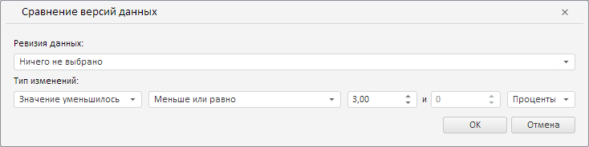

# RevisionComparisonWizard.CurrentState

RevisionComparisonWizard.CurrentState
-

**

# RevisionComparisonWizard.CurrentState

## Синтаксис

CurrentState: Object

## Описание

Свойство CurrentState** определяет текущие настройки мастера для валидации данных путём сравнения их версий.

## Комментарии

Значение свойства устанавливается с помощью метода setCurrentState, а возвращается с помощью метода getCurrentState. Из JSON значение задать нельзя.

## Пример

Для выполнения примера необходимо наличие на html-странице экземпляра класса [RevisionComparisonWizard](RevisionComparisonWizard.htm) с наименованием «revisionComparisonWizard» (см. «[Конструктор RevisionComparisonWizard](Constructor_RevisionComparisonWizard.htm)»). Определим новые настройки для мастера валидации данных путём сравнения их версий:

// Определим новые настройки мастера
var state = {
    // Тип изменений - "Значение уменьшилось"
    "compType": PP.TS.ValidationRevisionMetadataComparisonType.Decrease,
    "value": {
        "compOper": PP.TS.ValidationComparisonOperator.LessOrEqual,
        "percentage": true,
        "value1": 3
    }
};
// Установим данные настройки
revisionComparsionWizard.setCurrentState(state);

В результате выполнения примера в поле «Ревизия данных» данного мастера было установлено значение «Ничего не выбрано», в группе «Тип изменений» - «Значение уменьшилось», операция сравнения «меньше или равно» и значение, равное 3%:

См. также:

[RevisionComparisonWizard](RevisionComparisonWizard.htm)

		Справочная
		 система на версию 10.9
		 от 18/08/2025,
		 © ООО «ФОРСАЙТ»,
