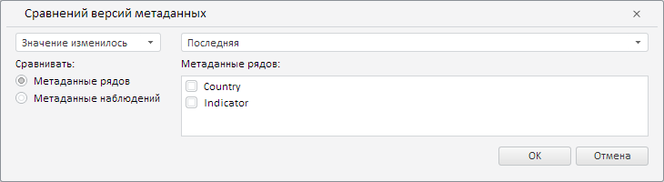

# Конструктор RevisionMetadataComparisonWizard

Конструктор RevisionMetadataComparisonWizard
-

**

# Конструктор RevisionMetadataComparisonWizard

## Синтаксис

PP.TS.Ui.RevisionMetadataComparisonWizard(settings: Object);

## Параметры

settings. JSON-объект со значениями свойств класса.

## Описание

Конструктор RevisionMetadataComparisonWizard** создаёт экземпляр класса [RevisionMetadataComparisonWizard](RevisionMetadataComparisonWizard.htm).

## Пример

Для выполнения примера необходимо наличие на html-странице компонента [WorkbookBox](../../../Components/TimeSeries/WorkbookBox/WorkbookBox.htm) с наименованием «workbookBox» (см. «[Пример создания компонента WorkbookBox](../../../Components/TimeSeries/WorkbookBox/Component_WorkbookBox.htm)»). Создадим и разместим в диалоге мастер для валидации данных путём сравнения версий метаданных:

// Получим вкладку «Данные» на ленте инструментов рабочей книги
var dataCategory = workbookBox.getRibbonView().getDataCategory();
// Определим возвратную функцию
var onRequestMetadata = function (sender, args) {
    dataCategory.RequestMetadata.fire(dataCategory, args);
};
// Создадим диалог правила валидации данных путём сравнения версий метаданных
var revisionMetadataComparisonWizard = new PP.TS.Ui.RevisionMetadataComparisonWizard({
    Source: workbookBox.getSource(), // Определим источник данных
    RequestMetadata: new PP.Delegate(this.onRequestMetadata, this)
});
// Получим DOM-дерево для данного мастера
var dom = revisionMetadataComparisonWizard.getDomNode();
// Установим стиль для мастера
PP.addClass(dom, "PPValidationSettingsDlgContent");
// Добавим полученный мастер в диалог
var dialog = new PP.Ui.Dialog({
    Content: revisionMetadataComparisonWizard,
    Caption: "Сравнений версий метаданных", // Заголовок диалога
    Width: 730, // Ширина диалога
    Height: 200 // Высота диалога
});
// Отобразим данный диалог
dialog.show();

В результате выполнения примера был создан и размещён в диалоге мастер для валидации данных путём сравнения версий метаданных:

См. также:

[RevisionMetadataComparisonWizard](RevisionMetadataComparisonWizard.htm)

		Справочная
		 система на версию 10.9
		 от 18/08/2025,
		 © ООО «ФОРСАЙТ»,
